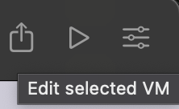

# Lab 1a) Chipyard Setup

## Background: Chipyard

As seen in lecture and the [Chipyard repository](https://github.com/ucb-bar/chipyard)..

> Chipyard is an open source framework for agile development of Chisel-based systems-on-chip. It will allow you to leverage the Chisel HDL, Rocket Chip SoC generator, and other [Berkeley](https://berkeley.edu/) projects to produce a [RISC-V](https://riscv.org/) SoC with everything from MMIO-mapped peripherals to custom accelerators. Chipyard contains processor cores ([Rocket](https://github.com/freechipsproject/rocket-chip), [BOOM](https://github.com/riscv-boom/riscv-boom), [CVA6 (Ariane)](https://github.com/openhwgroup/cva6/)), vector units ([Saturn](https://github.com/ucb-bar/chipyard/blob/main/saturn), [Ara](https://github.com/ucb-bar/chipyard/blob/main/ara)), accelerators ([Gemmini](https://github.com/ucb-bar/gemmini), [NVDLA](http://nvdla.org/)), memory systems, and additional peripherals and tooling to help create a full featured SoC. Chipyard supports multiple concurrent flows of agile hardware development, including software RTL simulation, FPGA-accelerated simulation ([FireSim](https://fires.im/)), automated VLSI flows ([Hammer](https://github.com/ucb-bar/hammer)), and software workload generation for bare-metal and Linux-based systems ([FireMarshal](https://github.com/firesim/FireMarshal/)). Chipyard is actively developed in the [Berkeley Architecture Research Group](http://bar.eecs.berkeley.edu/) in the [Electrical Engineering and Computer Sciences Department](https://eecs.berkeley.edu/) at the [University of California, Berkeley](https://berkeley.edu/).

For now, just know that Chipyard is a collection of open source projects that will help us develop our system-on-chip (SoC). Like Chisel, it is frequently found in Berkeley research and occasionally in industry. Each class introduces Chipyard a little differently. In EECS151T, we will focus on aspects most relevant to integrating our EECS151LA CPU cores into the SoC. 

If you ever need more resources:
- [Chipyard repository](https://github.com/ucb-bar/chipyard)
 - Chipyard Documentation: [https://chipyard.readthedocs.io/](https://chipyard.readthedocs.io/)
- Chipyard Basics slides: [https://fires.im/asplos23-slides-pdf/02_chipyard_basics.pdf](https://fires.im/asplos23-slides-pdf/02_chipyard_basics.pdf)

## Chipyard Setup 

If you have an instructional account (ee198-20-xyz preferred, but cs199-xyz also works), follow instructions under [EDA Machines/Instructional Account](#eda-machinesinstructional-account). If you do not have an instructional account, follow setup instructions under [Local on Apple Silicon (ARM) Machines](#chipyard-setup-local-on-apple-silicon-arm-machines).

### Chipyard Setup: EDA Machines/Instructional Account

We will now set up your Chipyard environment.

**(1)** **First, make a branch of our public Chipyard repo fork.** 

It will look something like: ``https://github.com/ucb-eecs151tapeout/ofot-chipyard``

**(2) Once your personal repo is created, copy down the SSH clone URL.**

Don't clone Chipyard locally.  For this course, you must work in the `/scratch` directory on a lab machine of your choice. Since `/scratch` is not automatically backed up, you will need to login to the same server each time. Chipyard will generate too much data for it to fit in your home directory.

> Note: As of Fall 2024, only eda-1 has been tested.

**(3) Make sure you know your instructional account login.**

*(These instructions are very similar to [EECS151 Lab 1](https://github.com/EECS150/asic-labs-sp24/tree/main).. Review that lab if you need a refresher on using instructional machines.)*

You may need to generate an instructional account:
1. Visit WebAcct: [http://inst.eecs.berkeley.edu/webacct](http://inst.eecs.berkeley.edu/webacct).
2. Click "Login using your Berkeley CalNet ID"
3. Click on "Get a new account".

Once the account has been created, you can email your class account form to yourself to have a record of your account information. You can follow the instructions on the emailed form to change your Linux password with `ssh update.eecs.berkeley.edu` and following the prompts.

As of this writing, we are still figuring out these accounts, so please post questions if you run into issues. Like EECS151, the servers used for this class are most likely primarily `eda-[1-4].eecs.berkeley.edu`.

You can check which machines are available at: [https://hivemind.eecs.berkeley.edu/](https://hivemind.eecs.berkeley.edu/).

**(4) Login to a lab machine over SSH.**

*(These instructions are very similar to [EECS151 Lab 1](https://github.com/EECS150/asic-labs-sp24/tree/main).. Review that lab if you need a refresher on using instructional machines.)*

Note: If you are off-campus (or off the EECS network), you may need to use the GlobalProtect VPN for these steps.

**SSH is the preferred connection because most work will be performed using the terminal and should be used unless a GUI is required**. The SSH protocol also enables file transfer between your local and lab machines via the `sftp` and `scp` utilities. **WARNING: DO NOT transfer files related to CAD tools to your personal machine. Only transfer files as needed.**

How To:

- Linux, BSD, MacOS  
    
    Access your workstation through SSH by running:
    
    ```shell
    ssh USERNAME@eda-X.eecs.berkeley.edu
    ```
    
    In our examples, this would be:
    
    ```shell
    ssh USERNAME@eda-8.eecs.berkeley.edu
    ```
    
- Windows  

	The classic and most lightweight way to use SSH on Windows is PuTTY ([https://www.putty.org/](https://www.putty.org/)). Download it and login with the FQDN above as the Host and your instructional account username. You can also use WinSCP (winscp.net) for file transfer over SSH.
    
    Advanced users may wish to install Windows Subsystem for Linux ([https://docs.microsoft.com/en-us/windows/wsl/install-win10](https://docs.microsoft.com/en-us/windows/wsl/install-win10), Windows 10 build 16215 or later) or Cygwin (cygwin.com) and use SSH, SFTP, and SCP through there.

**(5) Please, please - use tmux!**

It is _**highly**_ recommended to utilize one of the following SSH session management tools: `tmux` or `screen`. This would allow your remote terminal sessions to remain active even if your SSH session disconnects, intentionally or not. Below are tutorials for both:

- [Tmux Tutorial](https://www.hamvocke.com/blog/a-quick-and-easy-guide-to-tmux/)
- [Screen Tutorial](https://www.rackaid.com/blog/linux-screen-tutorial-and-how-to/)

> [!WARNING]
> If you run commands in a "raw" (without `nohup` or `tmux`) SSH terminal, they will be killed when you exit your session (or if your wifi goes out for a few seconds).
> 
> To use [`tmux`](https://tmuxcheatsheet.com/), you can add `RemoteCommand tmux new -A -s ssh` to your ssh config for your instructional account or run `tmux new-s -t <name>` once you log in. (Reference the tutorial above if you're confused.)
> 
> You can also run a command `cmd` as `nohup cmd` to prevent the command from being killed if the session exits, but this is less convenient.
> 
> If you manually created a `tmux` session, you must reattach to it manually the next time you log in with `tmux a -t <name>`.

Whenever you enter an SSH session, you should start or attach to a `tmux` session. 

**(6)** **Run the commands below in a `bash` terminal.**

During the `bash Miniforge3.sh` and `./build-setup.sh` commands, say "yes" and press enter when prompted.

The following will source the eecs151t bashrc (locating license and binary paths etc.) on startup moving forward. Only `~/.bash_profile` is `source`d on shell startup on instructional machines by default.
```
echo "source ~/.bashrc" >> ~/.bash_profile
echo "source /home/ff/ee198/ee198-20/.eecs151t.bashrc" >> ~/.bashrc
source ~/.bash_profile
```
Now create your `/scratch` directory and install `conda`:

```
mkdir -m 0700 -p /scratch/$USER
cd /scratch/$USER
wget -O Miniforge3.sh \
"https://github.com/conda-forge/miniforge/releases/latest/download/Miniforge3-$(uname)-$(uname -m).sh"
bash Miniforge3.sh -p "/scratch/${USER}/conda"
```

You will see the line, "For changes to take effect, close and re-open your current shell." Instead, run:

```
source ~/.bashrc
```

Then, setup your repo.

```
git clone git@github.com:ucb-eecs151tapeout/ofot-chipyard.git
cd ofot-chipyard
git checkout -b ${USER}-working # create your own branch!
git push --set-upstream origin ${USER}-working
```

**(7)** **Run the commands below in a `bash` terminal.**

These next scripts may take a very long time (potentially over 32 minutes). Don't forget to `tmux`!

```
./build-setup.sh riscv-tools -s 6 -s 7 -s 8 -s 9 -s 10 --use-lean-conda
```

If you get errors here, you can check `build-setup.log` to confirm the issue. 
Then check the FAQ or ask on Discord.

```
source env.sh
./scripts/init-vlsi.sh sky130
```

If you see ``Setup complete!`` you're done!

If you get ``Permission denied`` errors, remember to generate or copy over your SSH key as described in the Prelab.

Then, run the following:

```
conda config --add channels ucb-bar
conda config --set channel_priority strict
mamba install firtool
```

The TL;DR of these commands is that you now have a working Chipyard environment! 

> [!TIP]
> More specifically, these scripts are responsible for setting up the tools and environment used by the course.
> 
> - Conda is an open-source package and environment management system that allows you to quickly install, run, and update packages and their dependencies. In other words, conda allows users to create an environment that holds system dependencies like make, gcc, etc. We need to activate this conda environment.
> - We use commercial tools such as VCS from a common installation location. We add this location to the path and source relevant licenses.
>
> The shell script will initialize and checkout all of the necessary git submodules. When updating Chipyard to a new version, you will also want to rerun this script to update the submodules. Using git directly will try to initialize all submodules; this is not recommended unless you expressly desire this behavior.
>
> git submodules allow you to keep other Git repositories as subdirectories of another Git repository. For example, the above script initiates the rocket-chip submodule which is its own Git repository that you can look at here. If you look at the .gitmodules file at top-level chipyard, you can see
>
> [submodule "rocket-chip"]
>	path = generators/rocket-chip
>	url = https://github.com/chipsalliance/rocket-chip.git
> which defines this behavior. Read more about git submodules here.
>
>Feel free to look at the scripts themselves if you want to learn more.

### Chipyard Setup: Local on Apple Silicon (ARM) Machines

Follow instructions here if you do not have an instructional account (`ee198-20-xxx` account). If you do have an instructional account and have completed setup in the [EDA Machines/Instructional Account](#chipyard-setup-eda-machinesinstructional-account) section, you should skip this section and continue to [Using the environment](#using-the-environment).

Note: Setting up Chipyard locally on your machine is a highly involved, experimental process that will require a significant amount of compute and disk space on your local machine. For disk space, expect to use around 100+GB for a setup that allows you to run the full tapeout flow. Otherwise, expect to use around 60GB of disk space.

Tl;Dr: We will setup Ubuntu 24.04 LTS via Qemu on your ARM machines where you can install Chipyard in. The following instructions will be for Apple Silicon devices but the gist applies for any other ARM based device.

**Two definitions to make our lives easier:**
1. **Host machine (or "Host")** = Your Mac/Machine that you will be running the Virtual Machine on
2. **Guest machine (or "Guest")** = The virtual machine (VM) that is running Ubuntu 24.04 LTS

**(1)** **Install UTM or Qemu & Ubuntu 24.04 LTS ISO** 

For UTM: https://mac.getutm.app/ - Use the "Download" button on the website as the Apple Store download requires you to pay. Downloading via the website is free. 

Install UTM as you would install any Mac app.

> Note: UTM is just a Qemu wrapper/GUI and is fully open source. If you prefer, you can install Qemu directly via the command line.

For Ubuntu 24.04 LTS: https://ubuntu.com/download/server and download **Ubuntu Server 24.04.xx LTS** (the `xx` can be any number).

**(2) Install Ubuntu 24.04 LTS on UTM/Qemu**

1. Click "Create a New Virtual Machine"
2. Choose **Emulate** since we will be running an x86 machine on ARM
3. Choose "Linux"
4. Select the location of your Ubuntu ISO under "Boot ISO Image" - Leave all other settings on this page alone
5. On the "Hardware" settings page, make sure you have the following:

    * Architecture: x86_64
    * System: Standard PC (Q35 + ICH9, 2009) (alias of pc-q35-9.1) (q35)
    * Memory: 4096 MiB (Can be changed depending on your Host machine specs)
    * CPU/CPU Cores: 4 (Can be changed depending on your Host machine specs)
    * Hardware OpenGL Acceleration: Leave **UNCHECKED**

6. On the "Storage" settings page, set "Specify the size of the drive where data will be stored into." to **64 GiB** - (Can be changed depending on your Host machine specs - But expect this number to increase if you are planning to run the entire Sky130 Tapeout Flow up to GDS generation.)

7. On the "Shared Directory" page, **leave all settings as is**. 

8. Your "Summary" page should look like the following:

<p align="center">

</p>

9. If everything looks good, click "Save". **BUT DO NOT BOOT/CLICK THE PLAY BUTTON YOUR MACHINE AFTER SAVING.** 
> Note: Starting the machine immediately after creation could cause `wget` commands as part of Chipyard setup to fail when we set Chipyard up. Correcting this problem after Linux has been installed and setup can be quite a headache, so we'd rather deal with that here before the OS is fully installed. 

**(3) Edit VM Settings (Round 1: Before First Boot)**

* Go to the VM settings page towards the right of the top bar - shown below:

<p align="center">
    </img>
</p>

* Go to "Network" under the "Devices" Tab on the left
* Set "Network Mode" to "Bridged (Advanced)"
* Check "Show Advanced Settings"
* Then Check "Isolate Guest from Host"
* Leave everything else alone - including the MAC address
* Click "Save"

> *Note: What did we do here? And Why?* 
> 
> We are telling Qemu to set up our Guest as a completely separate device that, from the network perspective, is completely unrelated to our Host Machine. This will allow the Guest to acquire its own IP on the network via DHCP. Typically, one downside of Qemu is how tricky it is to access the public/outside Internet in a Guest device, this often results in a situation where either ICMP (and therefore `wget` -- needed for Chipyard) does not work, or TCP/UDP doesn't work (unless you do additional configuration on the Host machine in conjunction with the Guest machine). The setting we applied makes all these problems go away by making it so that from your internet provider's perspective, you have set up a new, physical, computer on the network. If you are curious, read more [here](https://wiki.qemu.org/Documentation/Networking) and [here](https://docs.getutm.app/settings-qemu/devices/network/network/#network-mode).

**(4) Boot & Install Linux**

* Select "Try of Install Ubuntu Server" on the GRUB Bootloader Screen.
* Once you get put into the screen to select your language (might take a while), select your desired language. For the purpose of this tutorial, we will use English.
* Go through the typical Linux install process - a couple things of note:
    * **Don't** install "Ubuntu Server (minimized)"
    * On the storage configuration page, **uncheck** "Set up this disk as an LVM group" - This is mainly a quality of life change, if you want to use LVM, feel free - but the following instructions will assume you have unchecked LVM.
    * **Install** OpenSSH Server - Don't worry about importing an SSH key for now.
* After installation & during reboot, you will be prompted to remove the installation medium. Go to the UTM app and with the VM selected on the left, scroll down on towards the bottom on the right. You will see a "CD/DVD" dropdown. Open the dropdown and click "Clear".
* After doing this, go back to your Serial Console, hit the enter key.
* After you get booted into Linux, make sure you can log in, then shutdown the machine.

> Note: If you cannot get network access during the installer
> 
> Go back to step 3, and change "Bridged Interface" in the Network settings to en0 or your default network interface on your Host machine. - You can check your default network interface on your host machine via the `ifconfig` command in your Host machine's terminal. Choose a network interface that has a `inet` address and show `status: active`.

**(5) Edit VM Settings (Round 2: After Install)**

* Go back to the VM settings page (Click on "Edit selected VM")
* Under the left bar, go to "QEMU", then select "Arguments". Scroll to the bottom.
* Do the following in order:
    1. Click "New" 
    2. Enter `-netdev`
    3. Click "New"
    4. Enter `vmnet-shared,id=net1`
    5. Click "New"
    6. Enter `-device`
    7. Click "New"
    8. Enter `e1000,netdev=net1`
    9. Click "New" - This step is **required!**
* Save & Boot the VM

**(6) Configure Guest IP Settings after Boot for SSH**

* After logging in, run `ip a`. You should see something like the following:
    ```
    ofo@ofo:~$ ip a
    1: lo: ‹LOOPBACK,UP,LOWER_UP> mtu 65536 qdisc noqueue state UNKNOWN group default qlen 1000
        link/loopback 00:00:00:00:00:00 brd 00:00:00:00:00:00
        inet 127.0.0.1/8 scope host lo
            valid_lft forever preferred_lft forever
        inet6 ::1/128 scope host noprefixroute
            valid_lft forever preferred_lft forever
    2: enp0s1: <BROADCAST,MULTICAST,UP,LOWER_UP> mtu 1500 qdisc tq_codel state UP group default qlen 1000
        link/ether a2:b5:c2:87:87:e1 brd ff:ff:ff:ff:ff:ff
        inet 10.41.136.246/22 metric 100 bro 10.41.139.255 scope global dynamic enp0s1
            valid_lft 887sec preferred_lft 887sec
        inet6 fe80::a0b5:c2ff:fe87:87e1/64 scope link
            valid_lft forever preferred_lft forever
    3: enp0s7 ‹BROADCAST, MULTICAST> mtu 1500 qdisc noop state DOWN group default qlen 1000
        link/ether 52:54:00:12:34:56 brd ff:ff:ff:ff:ff:ff
    ```
* As long as we see a 3rd network interface (in this case: `enp0s7`), we are good to go. **From now on, replace `enp0s7` with your specific network interface name.**

* Run: `sudo vim /etc/netplan/50-cloud-init.yaml`. In the YAML file, add the last section (starting at `enp0s7`) so that your file looks like the following:
    <!-- ```
    sudo ip link set enp0s7 up
    sudo systemctl restart systemd-networkd
    sudo ip addr add 192.168.64.2/24 dev enp0s7
    sudo ip link set enp0s7 up
    ``` -->
    ```yaml
    network:
      version: 2
      ethernets:
        enp0s1: # name here will be your 2nd network interface (first non loopback interface) name - this should be there already
          dhcp4: true
        enp0s7: # the content from this line to the end should be what you add
          dhcp4: false
          addresses: 
            - 192.168.64.2/24
    ```

* Save the file, then run `sudo netplan generate`. Make sure the terminal doesn't return any errors.
* Run `sudo netplan apply`
* Run `ip a`. Your 3rd (`enp0s7`) network interface should look like this:
    ```
    3: enp0s7: <BROADCAST,MULTICAST,UP,LOWER_UP> mtu 1500 qdisc fq_codel state UP group default qlen 1000
    link/ether 52:54:00:12:34:56 brd ff:ff:ff:ff:ff:ff
    inet 192.168.64.2/24 brd 192.168.64.255 scope global enp0s7
       valid_lft forever preferred_lft forever
    ```

> *Note: Why did we do this?*
> 
> Read the note in step (3) for context.
>
> We have fixed the problem of getting our Guest machine Internet access but now how do we access the Guest machine from our Host Machine? We could just do everything through the window that UTM gives us, but we want to use SSH and our Host computer's shell because that's a much nicer user experience (Copy paste 🖌️, colors 🎨, etc etc...). But recall we set our machine up like a "new computer" to the network. Under this model, we need the IP of our device on the network to SSH - But since we are using DHCP, this address changes once in a while, killing our SSH session randomly. Also, some networks (such as eduroam or other university networks) won't allow you to SSH into other devices on the network. What we did in step (5) & (6) was create a Local Area Network (LAN) on your Host that includes your Host & Guest machine, then created new network interfaces on Host & Guest to talk on this LAN. This then allows you to have a local, direct line from your Host machine to your Guest machine via SSH. If you go to your Host machine and ping `192.168.64.2`, you will notice 1-2ms ping time.


**(7) Reboot, SSH, .bashrc environment variables**

* At this point, you can reboot Guest. 
* Once the Guest reboots, you can minimize the UTM window showing you the console and SSH into your machine using `ssh <username>@192.168.64.2` on your Host machine.
* Run the following commands:
    ```
    touch ~/.eecs151t.bashrc
    vim .eecs151t.bashrc
    ```
* Write any environment variables that is needed for the OpenROAD flow here. The guide for that is [here](https://chipyard.readthedocs.io/en/latest/VLSI/Sky130-OpenROAD-Tutorial.html).

* If you are planning to use the Commercial (non Open Source RTL-to-GDS) flow:
    ```
    # add paths
    export PATH=$PATH:<Path to helper binaries like firtool and CIRCT>
    export LM_LICENSE_FILE=<Insert License Path or Licensing Server here>
    ```
    * You need to set the `LM_LICENSE_FILE` variable to point to your Commercial tool chain license file or licensing server. You can typically talk to your institution's IT department to see if they have purchased a license.
        * If you do not have access to Commercial tooling, you can consider using the OpenROAD RTL-to-GDS flow. The guide for that is [here](https://chipyard.readthedocs.io/en/latest/VLSI/Sky130-OpenROAD-Tutorial.html), however this flow can be more buggy than the Commercial flow (Siemens EDA flow).

**(8) Please, please - use tmux!**

It is _**highly**_ recommended to utilize one of the following SSH session management tools: `tmux` or `screen`. This would allow your remote terminal sessions to remain active even if your SSH session disconnects, intentionally or not. Below are tutorials for both:

- [Tmux Tutorial](https://www.hamvocke.com/blog/a-quick-and-easy-guide-to-tmux/)
- [Screen Tutorial](https://www.rackaid.com/blog/linux-screen-tutorial-and-how-to/)

> [!WARNING]
> If you run commands in a "raw" (without `nohup` or `tmux`) SSH terminal, they will be killed when you exit your session (or if your wifi goes out for a few seconds).
> 
> To use [`tmux`](https://tmuxcheatsheet.com/), you can add `RemoteCommand tmux new -A -s ssh` to your ssh config for your instructional account or run `tmux new-s -t <name>` once you log in. (Reference the tutorial above if you're confused.)
> 
> You can also run a command `cmd` as `nohup cmd` to prevent the command from being killed if the session exits, but this is less convenient.
> 
> If you manually created a `tmux` session, you must reattach to it manually the next time you log in with `tmux a -t <name>`.

Whenever you enter an SSH session, you should start or attach to a `tmux` session. 

**(9)** **Run the commands below in a `bash` terminal.**

During the `bash Miniforge3.sh` and `./build-setup.sh` commands, say "yes" and press enter when prompted.

The following will source the eecs151t bashrc (locating license and binary paths etc.) on startup moving forward. Only `~/.bash_profile` is `source`d on shell startup on instructional machines by default.
```
echo "source ~/.bashrc" >> ~/.bash_profile
echo "source ~/.eecs151t.bashrc" >> ~/.bashrc
source ~/.bash_profile
```
Now create your `/scratch` directory and install `conda`:

```
sudo mkdir -m 0777 -p /scratch/$USER
cd /scratch/$USER
wget -O Miniforge3.sh \
"https://github.com/conda-forge/miniforge/releases/latest/download/Miniforge3-$(uname)-$(uname -m).sh"
bash Miniforge3.sh -p "/scratch/${USER}/conda"
```

You will see the line, "For changes to take effect, close and re-open your current shell." Instead, run:

```
source ~/.bashrc
```

Then, setup your repo.

```
git clone git@github.com:ucb-eecs151tapeout/ofot-chipyard.git
cd ofot-chipyard
git checkout -b ${USER}-working # create your own branch!
git push --set-upstream origin ${USER}-working
```

**(10)** **Run the commands below in a `bash` terminal.**

These next scripts may take a very long time (potentially over 32 minutes). Don't forget to `tmux`!

```
./build-setup.sh riscv-tools -s 8 -s 7 -s 8 -s 9 -s 10 --use-lean-conda
```

If you get errors here, you can check `build-setup.log` to confirm the issue. 
Then check the FAQ or ask on Discord.

```
source env.sh
./scripts/init-vlsi.sh sky130
```

If you see ``Setup complete!`` you're done!

If you get ``Permission denied`` errors, remember to generate or copy over your SSH key as described in the Prelab.

Then, run the following:

```
conda config --add channels ucb-bar
conda config --set channel_priority strict
mamba install firtool
```

The TL;DR of these commands is that you now have a working Chipyard environment! 

> [!TIP]
> More specifically, these scripts are responsible for setting up the tools and environment used by the course.
> 
> - Conda is an open-source package and environment management system that allows you to quickly install, run, and update packages and their dependencies. In other words, conda allows users to create an environment that holds system dependencies like make, gcc, etc. We need to activate this conda environment.
> - We use commercial tools such as VCS from a common installation location. We add this location to the path and source relevant licenses.
>
> The shell script will initialize and checkout all of the necessary git submodules. When updating Chipyard to a new version, you will also want to rerun this script to update the submodules. Using git directly will try to initialize all submodules; this is not recommended unless you expressly desire this behavior.
>
> git submodules allow you to keep other Git repositories as subdirectories of another Git repository. For example, the above script initiates the rocket-chip submodule which is its own Git repository that you can look at here. If you look at the .gitmodules file at top-level chipyard, you can see
>
> [submodule "rocket-chip"]
>	path = generators/rocket-chip
>	url = https://github.com/chipsalliance/rocket-chip.git
> which defines this behavior. Read more about git submodules here.
>
>Feel free to look at the scripts themselves if you want to learn more.

## Using the environment

To enter your Chipyard environment, you will need to run the following command in each terminal session you open (including new `tmux` sessions).

```
source /scratch/$USER/ofot-chipyard/env.sh
```

This env.sh file should exist in the top-level repository. This file sets up necessary environment variables such as PATH for the current Chipyard repository. This is required by future Chipyard steps such as the make system to function correctly.


> [!TIP]
> If you would like to run this automatically on terminal startup, you can add the command to your `~/.bashrc`
> by running the following:
>
> ```
> echo "source /scratch/$USER/ofot-chipyard/env.sh" >> ~/.bashrc
> ```

Optionally, you can also set the repo path as an environment variable by running `export wd=/scratch/$USER/ofot-chipyard` and then jump to it with `cd $wd`.
Note that `export` only lasts until you close the terminal session, add a command to `~/.bashrc` to have it run every time you start a new commandline session!

## Your first VLSI run!

From the `vlsi` folder, after sourcing `env.sh` in the toplevel directory, run:
``make drc tutorial=sky130-commercial IS_TOP_RUN=0``
Eventually (again, make sure to run these commands in tmux so they don't get killed when you shut your laptop lid!), you should be presented with a biblical flood of output that ends with these lines:

```
Pegasus finished normally. 2025-01-30 19:19:53
Action drc config output written to output.json
```

This command invokes synthesis, place-and-route, and DRC checking on a simple SoC design. Don't worry too much about what it's doing right now (although you're always welcome to read through the files).
This is just to make sure your repository is setup right and you are able to invoke the tools you'll need for the class.

Don't forget to complete the Gradescope check-in, and let us know on Discord if you run into any issues!

## Common setup issues (FAQ)

If you completed the setup successfully, you can skip this section.

### `hammer-mentor-plugins`-related errors

These should've been removed from this version of Chipyard, as `hammer-mentor-plugins` is a private repository. If you run into bugs, particularly during the `init-vlsi.sh` step, let us know.

You can also try fixing the problem yourself by doing the following..

Edit the init-vlsi.sh script, such as with vim:

`vim ./scripts/init-vlsi.sh`

Comment out the line:

`git submodule update --init --recursive vlsi/hammer`

Which with vim, can be done with `i` (insert) mode then `:wq` (write then quit) once you're done.

Rerun: `./scripts/init-vlsi.sh sky130`

For context, the reason for this error is that we do not have a local copy of `hammer-mentor-plugins` setup and `mentor` is not an open source tool, so the online repo is private. The script tries to pull from the private repo to update the submodule and can't find it. But we're not using that tool, so we can skip it.


### `build-setup` transaction failed

If you observe that the `conda` install transaction failed, which is often caused by stopping `./build-setup` prematurely, you will likely need to reinstall conda. To do so, reinstall `conda` by running the following commands:

```bash
cd /scratch/$USER/<semester>-chipyard-<uname>
rm -rf .conda-env
cd ..
rm -rf conda
bash Miniforge3.sh -p "/scratch/${USER}/conda"
source ~/.bashrc
```

A dead giveaway is: ``ERROR:root:CondaValueError: prefix already exists: [....]/ofot-chipyard/.conda-env``

In which case, make sure to delete that ``.conda-env``. 

After running the above commands, go through the repo setup instructions again (you do not need to delete and re-clone the chipyard repo).

### Hanging on `configure: configuring default subproject`

This might happen if you try to run the installation without `unset`ing the `CONFIG_SHELL` environment variable.
To resolve it, run the following from the Chipyard root directory:

```
unset CONFIG_SHELL
source env.sh
./build-setup.sh riscv-tools -s 1 -s 2 -s 6 -s 7 -s 8 -s 9 -s 10 
```

This skips the steps that have already completed prior to the failure and retries the failed step.
Proceed as usual after the command succeeds.

### Repository Issues (like `divergent branches`)

When in doubt, for the sake of this lab, you can reset to the baseline with:

``git reset —hard origin/main``

You may not want to do this on your actual project as you may lose all your changes. But this Chipyard setup is just practice!

### Java Runtime `SIGSEGV` Error - Make fails at `common.mk:409: launch-sbt` of Step 5 of build-setup

This error should only happen if you are running an x86 Linux VM on Apple Silicon.

For an immediate fix, edit your VM settings to use only **1 core**. This will result in an extremely slow build, but it will build.

Another fix that seems to have some effect is changing the Qemu process's task policy and in return how MacOS handles scheduling for the Qemu process. 

The bug seems to be triggered when MacOS switches the Qemu process over from Efficiency Cores to Performance Cores and vice versa. That switch seems to cause a Segfault. 

In a terminal:
```
sudo taskpolicy -p 30548 -t 5 -l 1
sudo taskpolicy -b -p 30548
```
The first command tells MacOS to set low prioritization for throughput and high prioritization for latency. The second command assigns the process as a background task, pinning it to the efficiency cores. We cannot sustainably pin processes to performance cores, so we have to use the efficiency cores in the meantime.

Make sure you have pulled the latest version of the OFOT-Chipyard repository. If this happens even after using the latest OFOT-Chipyard repository, notify your instructor.

There isn't a fix for this error with multi-core VMs as of Mar 2025. An extensive bug report has been filed [here](https://github.com/utmapp/UTM/issues/7070).

Instructors: This should've either been fixed (by Apple, OpenJDK, Qemu, or UTM) or been patched in the Class CY or upstream CY. If none of the above has happened, check the status of this [GitHub issue](https://github.com/utmapp/UTM/issues/7070).

# Credits

Parts of this setup are inspired by Spring 2023 Tapeout and Spring 2024 EECS251B.
Chisel and Chipyard resources have been developed outside the course.

Virtual machine instructions for local Chipyard setup were developed by Jim Fang in Spring 2025.
