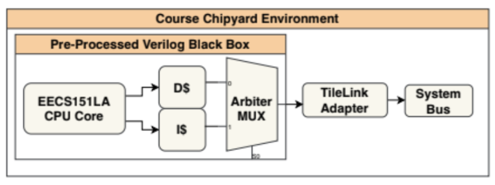

# Lab 2b) Exploring the TileLink Adapter

# Overview

So far, we have created a condensed single-file version of our CPU core and created a blackbox to use that Verilog core in a Chisel environment. While we have created this file in our generator folder, it is not actually tied to the rest of the system in any way. 

We have mapped the top-level Verilog signals of the CPU to Chisel signals. That means we now have access to our CPU's memory interface. But how do we use the intent conveyed by those signals to communicate with other devices on the chip? Chipyard uses [TileLink](https://static.dev.sifive.com/docs/tilelink/tilelink-spec-1.7-draft.pdf) as its on-chip bus procotol and if our Tile can speak it, it can speak to the rest of the tiles (which will be defined later) on the SoC! 

Unfortunately, your core doesn't already speak TileLink - it speaks the memory protocol dreamed up by 151LA TAs of days past. :) Luckily, we can write "adapter" Chisel to map one interface to another. That's the magic adapter we've been talking about!



# Part 1) Tile Setup

A `Tile` is a Chisel module extending `BaseTile` that instantiates logic (i.e. your core and the adapter) as well as nodes (such as the ones described above) to be connected to on-chip busses (`mbus` for example) within the module's `trait`. In this first part, we will take a look at the existing One Fifty One Tile (OFOT) implementation and follow along by implementing your own (buggy - but that's okay) `SuperFastPlaceboAccelerator.v`-containing Tile. 

Keeping with Chipyard convention, all relevant Scala code should be in `generators/YOUR-GENERATOR/src/main/scala/`.

## The (Not Legit) Super Fast Placebo Accelerator 

Imagine that for your side project, you have written the following Verilog in ``ofot-chipyard/generators/ofo/src/main/resources/vsrc/SuperFastPlaceboAccelerator.v``:

```
module SuperFastPlaceboAccelerator(
    input [31:0] A,B,
    input [3:0] ALUop,
    output reg [31:0] Out
);

always @(*) begin
    case (ALUop)
        default: Out = 0;
    endcase
end

endmodule
```

This revolutionary ALU accelerator dramatically improves the area, power, and critical path of your design by mapping every single operation on any combination of inputs to zero - ground-breaking! We won't ever verify it, so as far as anyone's concerned, the RTL is done. In a stroke of architectural genius, we have thrown out the rest of the EECS151LA CPU and will attach this "accelerator" itself as a core. 

Let's ignore for a second the lack of RISC-V compliance, the completely incompatible interface, and the general absurdity of the scenario. Obviously this is a silly example - but we will use it to practice writing our own Tile. (_If you do an actual accelerator as a side project, this is not how you do it!_)

A classic Tile will look something like the following:

```
package ofo

import chisel3._
import chisel3.util._
// Some more imports here

//////////////////////////////////////////////////////////////////
// the Config class
//////////////////////////////////////////////////////////////////

class WithPlaceboAccel extends Config((site, here, up) => {
  case TilesLocated(InSubsystem) => {
    // Copy pasta (with minor edit)!
  }
  case NumTiles => up(NumTiles) + n
})

//////////////////////////////////////////////////////////////////
// the CanAttachTile class
//////////////////////////////////////////////////////////////////

case class PlaceboAccelTileAttachParams(
  // Copy pasta!
) extends CanAttachTile {
  // Copy pasta (with minor edit)!
}

//////////////////////////////////////////////////////////////////
// CoreParams class
//////////////////////////////////////////////////////////////////

case class PlaceboAccelCoreParams(
  // Some custom params 
) extends CoreParams {
  // A whole bunch of default params
  // Copy pasta (with minor edit)!
}

//////////////////////////////////////////////////////////////////
// the InstantiableTileParams class
//////////////////////////////////////////////////////////////////

case class PlaceboAccelTileParams(
  // Copy pasta (with minor edit)!
) extends InstantiableTileParams[PlaceboAccelTile] {
  // Copy pasta (with minor edit)!
}

//////////////////////////////////////////////////////////////////
// the actual Tile class
//////////////////////////////////////////////////////////////////

class PlaceboAccelTile(
  // Copy pasta (with minor edit)!
) extends BaseTile(params, crossing.crossingType, lookup, q) {

  //////////////////////////////////////////////////////////////////
  // instantiate Implementation class
  //////////////////////////////////////////////////////////////////
  override lazy val module = new PlaceboAccelTileImp(this)

  //////////////////////////////////////////////////////////////////
  // required entry of CPU device in the device tree for interrupt purpose
  //////////////////////////////////////////////////////////////////
  val cpuDevice: SimpleDevice = new SimpleDevice("cpu", Seq("ucb-bar,placeboaccel", "riscv")) {
    // Copy pasta!
  }
  ResourceBinding {
    Resource(cpuDevice, "reg").bind(ResourceAddress(tileId))
  }

  //////////////////////////////////////////////////////////////////
  // define a TileLink client node
  //////////////////////////////////////////////////////////////////

  // # of bits used in TileLink ID for master node. 
  // 4 bits can support 16 master nodes, but you can have a longer ID if you need more.
  val idBits = 4
  val clientNode = TLClientNode(
    // Copy pasta (with minor edit)!
  )

  //////////////////////////////////////////////////////////////////
  // define a TileLink register node
  //////////////////////////////////////////////////////////////////

  val regNode = TLRegisterNode(
    // Copy pasta (with minor edit)!
  )

  //////////////////////////////////////////////////////////////////
  // connect TileLink nodes
  //////////////////////////////////////////////////////////////////

  // Required TileLink nodes
  val intOutwardNode = None
  val masterNode = visibilityNode
  val slaveNode = TLIdentityNode()

  // "slave" (legacy term) side - add register node
  tlSlaveXbar.node :*= regNode := slaveNode

  // "master" (legacy term) side - add client node
  tlOtherMastersNode := tlMasterXbar.node
  masterNode :=* tlOtherMastersNode
  tlMasterXbar.node  := clientNode
}

//////////////////////////////////////////////////////////////////
// the Implementation Tile class
//////////////////////////////////////////////////////////////////

class PlaceboAccelTileImp(outer: PlaceboAccelTile) extends BaseTileModuleImp(outer) {
  
  //////////////////////////////////////////////////////////////////
  // instantiate BlackBox class
  //////////////////////////////////////////////////////////////////
  val myTotallyLegitAccel = Module(
   // Copy pasta (with minor edit)!
  )

  //////////////////////////////////////////////////////////////////
  // connect IO to register node map (or other logic)
  //////////////////////////////////////////////////////////////////

  val io = myTotallyLegitAccel.io
  
  // MMIO everything
  val A_reg = Reg(UInt(32.W))
  val B_reg = Reg(UInt(32.W))
  val ALUop_reg = Reg(UInt(4.W))

  myTotallyLegitAccel.io.A := A_reg
  myTotallyLegitAccel.io.B := B_reg
  myTotallyLegitAccel.io.ALUop := ALUop_reg

  outer.regNode.regmap(
     // Create your regmap!
   )
}

//////////////////////////////////////////////////////////////////
// the BlackBox class
//////////////////////////////////////////////////////////////////

class PlaceboAccelBlackBox(implicit p: Parameters) 
    extends BlackBox with HasBlackBoxResource {

  // Define the PlaceboAccel IO
  val io = IO(new Bundle {
    // Define your io!
  })
  // Copy pasta (with minor edit)! - Hint: addResource
}
```

This might seem like a lot - but note the amount of "Copy Pasta." As with many other projects, the secret to Chipyard is knowing where to look for existing code. You can often search through existing generators for snippets of Chisel similar to what you're doing. In our case, we will study `ofo/src/main/scala/OFOTile.scala`. You can follow along by copying the above template into a `ofo/src/main/scala/PlaceboAcceleratorTile.scala` file, or simply submit your answers to Gradescope (we will not complete this Tile 100% and you will likely need to comment or hide the file later to avoid compilation issues). 

We will also turn to the official Chipyard documentation, particularly the [6.4. Adding a custom core](https://chipyard.readthedocs.io/en/stable/Customization/Custom-Core.html#create-tile-class) segment. Note the outlined steps and how they correspond to both our template and `OFOTile.scala`:

- 6.4.1. Wrap Verilog Module with Blackbox (NOT Optional) - Lab 2A

- 6.4.2. Create Parameter Case Classes

- 6.4.3. Create Tile Class

- 6.4.4. Connect TileLink Buses

- 6.4.5. Create Implementation Class

- 6.4.6. Connect Interrupt

- 6.4.7. Create Config Fragments to Integrate the Core

> [!TIP]
>
> A silly tip! If you ever want some help navigating documentation, try out this search engine tool: https://askjerry.net/
> 
> It might not work as well as StackOverflow does for Python, but hey, it's fun. 
> 
> 
> 
> Ask staff (or join the lab) if you'd like to know the lore. :D

## Wrap Verilog Module with Blackbox (6.4.1.)

Let's start off easy with something you've seen before..

**Step 0) [Gradescope] How would you complete the following BlackBox for the Really Fast Placebo Accelerator?**

```
//////////////////////////////////////////////////////////////////
// the BlackBox class
//////////////////////////////////////////////////////////////////

class PlaceboAccelBlackBox(implicit p: Parameters) 
    extends BlackBox with HasBlackBoxResource {

  // Define the PlaceboAccel IO
  val io = IO(new Bundle {
    // Define your io!
  })
  // Copy pasta (with minor edit)! - Hint: addResource
}
```

Hint: take a look at the interface!
```
module SuperFastPlaceboAccelerator(
    input [31:0] A,B,
    input [3:0] ALUop,
    output reg [31:0] Out
);
```

## Creating "Parameter Case Classes" (6.4.2.)

TileLink is not magic - it takes a bit of Chisel overhead to set up your Tile before making use of it. As seen in the [6.4. Adding a custom core](https://chipyard.readthedocs.io/en/stable/Customization/Custom-Core.html#create-tile-class) documentation, after the [6.4.1. Wrap Verilog Module with Blackbox](https://chipyard.readthedocs.io/en/stable/Customization/Custom-Core.html#wrap-verilog-module-with-blackbox-optional) step, you need to [6.4.2. Create Parameter Case Classes](https://chipyard.readthedocs.io/en/stable/Customization/Custom-Core.html#create-parameter-case-classes). These will help define the "traits" of your Tile and core.

A [trait](https://chipyard.readthedocs.io/en/stable/Customization/Keys-Traits-Configs.html#traits) provides Chipyard instructions on how to instantiate and hook up your generator to the SoC when requested. Note that 'trait' is also a Scala [construct](https://docs.scala-lang.org/tour/traits.html) used to enforce interfaces (used widely in the Chipyard codebase!). In Chipyard, a trait is not just an abstraction!

This can involve making decisions based on the input parameters, for example adding 'shims' (little bits of logic that sit in between two blocks to help them play nice) such as protocol adapters.

Traits for a given block need to be added to `DigitalTop` in order for configs (discussed later!) to be able to instantiate it.

**Step 1) The Practice Parameter Case Class**

[Gradescope] **How would you fill in the Placebo Accelerator Instantiable Tile Params class?**

As a reminder, this Tile is just practice - feel free to copy from the documentation and the OFOTile, and don't worry if you get something wrong. We are not even checking for compilation yet. There will be more fun(?) things to debug in the future. 

```
//////////////////////////////////////////////////////////////////
// the InstantiableTileParams class
//////////////////////////////////////////////////////////////////

case class PlaceboAccelTileParams(
  // Copy pasta (with minor edit)!
) extends InstantiableTileParams[PlaceboAccelTile] {
  // Copy pasta (with minor edit)!
}
```

(Note we are skipping making you write the CoreParams class in the `PlaceboAccel` example, although the class is in the template.)


### Creating "Parameter Case Classes" (in the OFOTile)

That's a lot of new words. Let's also go through how this class is implemented in the working OFOTile.

**Step 2) The Main Parameter Case Class**

Here we are just following along with the [6.4.2. Create Parameter Case Classes](https://chipyard.readthedocs.io/en/stable/Customization/Custom-Core.html#create-parameter-case-classes) documentation. When your core is generated, it will make use of  ``InstantiableTileParams``, a (Scala) trait defining the basic parameters required to instantiate a Tile, usually with default values. All cores must have their own implementation of `InstantiableTileParams` and `CoreParams`. 

**[Gradescope] What is the name of our `InstantiableTileParams` implementation for our Tile (`OFOTile`)?**

**[Gradescope] What is the name of our `CoreParams` implementation for our Tile (`OFOTile`)?**

You might realize now that we had you probe the `CoreParams` a bit in the black box section (recall the Floating Point extension question). Note that we ignore most of the parameter set (`useHypervisor`? `haveCFlush`?...). This is because unlike Rocket Core, our underlying core (the EECS151LA core) is not configurable - unless you made it so! If you included a Verilog switch to disable caches, for example, you could add a check for the `{i,d}cache` parameter when you instantiate the black box. 

Take a moment to appreciate how absurdly configurable the Rocket core is, by means of the default [CoreParams](https://chipyard.readthedocs.io/en/stable/Customization/Custom-Core.html#create-parameter-case-classes). Try to understand some of these parameters. 

**[Gradescope] What's a `CoreParam` you think was interesting or useful? How would you modify your EECS151LA RTL to take action based on it? (If you did implement something - let us know here!)**

**[Gradescope] What parameter might we need to tweak in `OFOTileParams` to avoid memory space collisions when instantiating multiple `OFOTile`s?** For example, when merging multiple groups' cores onto one SoC..

You might want to return to this part later if you decide to explore on your own and implement some new core-related features. Otherwise, feel free the answer hypothetically and move on.

**Step 3) The `CanAttachTile` Class**

As the doc mentions, we also need a class extending `CanAttachTile` to add the Tile config into the config system. This provides a ["standardized interface by which parameterized tiles can be attached to contexts containing interconnect resources."](https://github.com/chipsalliance/rocket-chip/blob/f517abbf41abb65cea37421d3559f9739efd00a9/src/main/scala/subsystem/HasTiles.scala#L148) 

**[Gradescope] Write a CanAttachTile class for `PlaceboAccelTile` with parameter class `PlaceboAccelTileParams`.** 

```
//////////////////////////////////////////////////////////////////
// the CanAttachTile class
//////////////////////////////////////////////////////////////////

case class PlaceboAccelTileAttachParams(
  // Copy pasta!
) extends CanAttachTile {
  // Copy pasta (with minor edit)!
}
```

## The Tile Class (6.4.3.)

We just saw how to create _parameter_ classes. But what makes _use_ of those parameters? Take a look at the other modules instantiated in `OFOTile` and the actual Tile that houses your core, the adapter, and various supporting hardware. Remember, a Tile is just a module that extends `BaseTile`. You can see this in your `PlaceboAccelTile` template:

```
//////////////////////////////////////////////////////////////////
// the actual Tile class
//////////////////////////////////////////////////////////////////

class PlaceboAccelTile(
  // Copy pasta (with minor edit)!
) extends BaseTile(params, crossing.crossingType, lookup, q) {
```

**Step 1) [Gradescope] How might you fill in the Tile instantiation lines above for Placebo Accelerator?** 

Even the template is a little lenthy. Here's pseudocode for an even smaller Tile module definition. Use it to guide you as your look over the RTL (and as you write your own). Notice our friend `OFOTileParams`? Here's where we'll actually read (at least some of) those config values we looked at before.

```
class MyTile(
  val ofoParams: OFOTileParams,
  crossing: ClockCrossingType,
  lookup: LookupByHartIdImpl,
  q: Parameters)
  extends BaseTile(myParams, crossing, lookup, q)
  with SinksExternalInterrupts
  with SourcesExternalNotifications
{

  // Required TileLink nodes
  val intOutwardNode = None
  val masterNode = visibilityNode
  val slaveNode = TLIdentityNode()

  // Implementation class, where the actual logic (not just tilelink stuff) is written

  // Required entry of CPU device in the device tree for interrupt purpose
  // Note that your core will ignore interrupts, since they aren't supported (yet!!)

  // TileLink nodes and connections
}
```

**Step 2) [Gradescope] Food for thought: in a multicore system, do I need to have a Tile for each core? Can I put multiple cores into one Tile? How might you know?** 

We will skip the TileLink nodes for now and continue with the easier steps.

## Create Implementation Class (6.4.5.)

What we did so far was implicity working with a "LazyModule", which executes before all hardware gets elaborated (and is often where we'll connect a TileLink node to a crossbar). A module implementation trait is the second type of trait in Rocket Chip and often depends on the LazyModule. Similarly, we now need an implementation class to contain the actual hardware we'll be working with. 

The documentation reads: "This class will normally contains Chisel RTL code. If your core is in Verilog, you will need to instantiate the black box class that wraps your Verilog implementation and connect it with the buses and other components." That sounds like us! Our hardware is in a black box.

**Step 1) [Gradescope] How might you instantiate the Placebo Accelerator BlackBox?** 

```
  //////////////////////////////////////////////////////////////////
  // instantiate BlackBox class
  //////////////////////////////////////////////////////////////////
  val myTotallyLegitAccel = Module(
   // Copy pasta (with minor edit)!
  )
```

### Create Implementation Class (in the OFOTile)

Without knowing it, you have already glanced at the OFOTile implementation class in Lab 2A. You will notice the logic in it is a bit more complicated than the (dysfunctional) Placebo Accelerator template. We will revisit it at the end of this. Meanwhile, take a fresh look at the `OFOTileImp` and answer the following question:

**Step 1) [Gradescope] What is the difference between what we put in `OFOTile` and what we put in `OFOTileImp`? They're both related to `OFOTile`, why not just have one class?**

## 6.4.6. Connect Interrupt

You will notice the following snippet of Chisel in most Tile classes. As the comment suggests, it (in theory) allows the Tile to accept external interrupts (`with SinksExternalInterrupts`). The Connect Interrupt section also explains how to make your core send interrupts. 

```
  //////////////////////////////////////////////////////////////////
  // required entry of CPU device in the device tree for interrupt purpose
  //////////////////////////////////////////////////////////////////
  val cpuDevice: SimpleDevice = new SimpleDevice("cpu", Seq("ucb-bar,placeboaccel", "riscv")) {
    // Copy pasta!
  }
  ResourceBinding {
    Resource(cpuDevice, "reg").bind(ResourceAddress(tileId))
  }
```

We trust you're getting the hang of copy pasting Chisel now, so we won't have you do it here! :D The way interrupt handling and device trees work is a complex topic in of itself, so we won't address it here. In fact, there'd be no point trying to implement interrupts at the Tile level with a vanilla EECS151LA core. 

**Step 1) [Gradescope] Why are we ignoring the interrupt implementation?** Hint: did the EECS151LA spec include any interrupt signals as part of the interface? If you didn't take EECS151, you can check the BlackBox interface. 

(Note: If this is something that interests you, interrupt handling could definitely be a worthwhile side project!)

## 6.4.7. Create Config Fragments to Integrate the Core

We will address Configs and why they matter in Lab 2C. Meanwhile, notice that this structure _exists_:

```
//////////////////////////////////////////////////////////////////
// the Config class
//////////////////////////////////////////////////////////////////

class WithPlaceboAccel extends Config((site, here, up) => {
  case TilesLocated(InSubsystem) => {
    // Copy pasta (with minor edit)!
  }
  case NumTiles => up(NumTiles) + n
})
```

# Part 2) TileLink Implementation

So far, we have skipped over TileLink nodes, if only to dedicate a whole segment to them! Remember `clientNode`s and `regNode`s from above? They're some of the most commonly used patterns for designing TileLink tiles in Chipyard.

TileLink is the [coherence](https://en.wikipedia.org/wiki/Cache_coherence) and memory protocol used by RocketChip and other Chipyard generators.
It is how different modules like caches, memories, peripherals, and DMA devices communicate with each other.

RocketChip’s TileLink implementation is built on top of Diplomacy, a framework for exchanging configuration information among Chisel generators in a two-phase elaboration scheme. For a detailed explanation of Diplomacy, see the [paper](https://carrv.github.io/2017/papers/cook-diplomacy-carrv2017.pdf) by Cook, Terpstra, and Lee.
Diplomacy is a complicated idea and we do not expect you to understand it fully for this lab.

Diplomacy represents the different components of an SoC as nodes of a directed acyclic graph. TileLink nodes can come in several different types. The three main types are: Client, Manager, and Register. In this lab, we will play with Client and Register nodes.

**Step 0: Warm-up question!**

You will always start your work a package statement (ex: `package ofo`) and imports:
```
import chisel3._
import chisel3.util._
```

**[Gradescope] What three additional `import`s are necessary to make use of TileLink in our Scala file?** Hint: check `OFOTile.scala`...

## Register Nodes

Recall you looked at memory maps earlier. Memory-mapped devices generally follow a common pattern. They expose a set of registers to the CPUs. By writing to a register, the CPU can change the device’s settings or send a command. By reading from a register, the CPU can query the device’s state or retrieve results. 

Register nodes are similar in construction to the manager nodes with additional logic to make manager nodes work as MMIO registers interface. They initiate TileLink transactions by sending requests on the A channel and receive responses on the D channel. In Chipyard, the register node can be instantiated in Chisel as shown below:

```
val ctrlNode = TLRegisterNode(
  address = Seq(AddressSet(params.ctrlAddress, 4096-1)),
  device = device,
  beatBytes = 8)
```

In Verilog, this looks like the interface shown below:

```
output tl_ctrl_a_ready,
input tl_ctrl_a_valid,
input [2:0] tl_ctrl_a_bits_opcode,
input [2:0] tl_ctrl_a_bits_param,
input [CTRL_SIZE_BITS-1:0] tl_ctrl_a_bits_size,
input [CTRL_SOURCE_BITS-1:0] tl_ctrl_a_bits_source,
input [CTRL_ADDR_BITS-1:0] tl_ctrl_a_bits_address,
input [(CTRL_DATA_BITS/8)-1:0] tl_ctrl_a_bits_mask,
input [CTRL_DATA_BITS-1:0] tl_ctrl_a_bits_data,
input tl_ctrl_a_bits_corrupt,
input tl_ctrl_d_ready,
output tl_ctrl_d_valid,
output [2:0] tl_ctrl_d_bits_opcode,
output [1:0] tl_ctrl_d_bits_param,
output [CTRL_SIZE_BITS-1:0] tl_ctrl_d_bits_size,
output [CTRL_SOURCE_BITS-1:0] tl_ctrl_d_bits_source,
output [CTRL_SINK_BITS-1:0] tl_ctrl_d_bits_sink,
output tl_ctrl_d_bits_denied,
output [CTRL_DATA_BITS-1:0] tl_ctrl_d_bits_data,
output tl_ctrl_d_bits_corrupt,
```

**Step 1) [Gradescope] What might your Placebo Accelerator register node look like?** Hint: when in doubt, copy `OFOTile.scala`.

```
  //////////////////////////////////////////////////////////////////
  // define a TileLink register node
  //////////////////////////////////////////////////////////////////

  val regNode = TLRegisterNode(
    // Copy pasta (with minor edit)!
  )
```

### Register Maps & MMIO

**Register maps** (`regmaps`) define signals and offsets from a given base `address`, generating a memory mapping for a given signal `s` and offset `o` from `0x{address + o}` to `s`. Mappings are defined as `{offset} -> RegField.{r,w,rw}({size}, {signal}` within `regNode.regmap(`. Registers can be read or write-only, or allow both reads and writes. 

These addresses can be wrote and written as any memory would, for example by `sw` or `lw` RISC-V instructions, but those addresses are hooked up to specific hardware signals! Pretty cool. :D 

This technique, referred to as **MMIO** (memory mapped input output), allows us to delay choosing values for certain (e.g. configuration) registers until runtime, which can be very convenient if we don't know the values at tapeout time, or want to be able to set them arbitrarily.

Let's say we wanted to MMIO every input and output of Placebo Accelerator. (Recall the MMIO example in Lab 2A.)

**Step 2) [Gradescope] How might you implement this? (There should be 4 lines).** 

```
outer.regNode.regmap(
     // Create your regmap!
   )
```

### Register Nodes (in the OFOTile)

The `ofo` adapter uses a **register node** to allow a **"supervisor" CPU** to control the reset and read the CSR of your EECS151LA core over the **memory bus** (`mbus`), an on-chip interconnect that exposes a global memory space that devices on chip can (sometimes) read and (sometimes) write to. Let's identify the node in `src/main/scala/OFOTile.scala` and revisit parts we skipped earlier.

**Step 3) Register Node scavenger hunt!**

**[Gradescope] Take a look at how the `ctrlNode` register node was instantiated above. Which `class` contains our register node? Is it an Implementation class?** 

**[Gradescope] Why don't we need to explicily manipulate the `regNode` ready, valid, etc., bits like we do for the `clientNode`?** Hint: `regNodes` are just a utility class provided by Chipyard! They aren't inherently special.

Now you can also use the register node name to find where it connects to the `mbus`. Recall that our interconnects are currently all-to-all, i.e. `Xbar`!

**[Gradescope] What one Chisel line connects the register node to the bus? Which `class` contains this declaration? Is it an Implementation class?**

Now we have a register node on the crossbar, but what is actually mapped to it? Note again the `address` field and what you learned in Lab 2A about passing in parameters using a separate parameter class. It's probably important! Once you find the register map, answer the following:

**[Gradescope] What is the default address, in the global `mbus` address space, to the blackbox-ed core's `csr` signal?** (Hint: first find the base address when the register node is instantiated, then find the offset to the signal when `regmap()` is called.)

## Client Nodes

TileLink client nodes ("clients") are modules that initiate TileLink transactions by sending requests on the A channel and receive responses on the D channel. Since we are focusing on non-[coherent](https://en.wikipedia.org/wiki/Cache_coherence) requests/responses in this lab, the other channels of TL (B, C, and E) are not included. **Coherence** is complicated, but super cool (and super useful for complex multi-core interactions)! Let the staff know ([151tapeout@ieee.berkeley.edu]) if you're interested in making your core coherent. :)

A client node can be instantiated in Chipyard by using the following code:

```
val clientNode = TLClientNode(Seq(TLMasterPortParameters.v1(Seq(TLClientParameters(
  name = params.deviceName,
  sourceId = IdRange(0, (1 << params.clientIdBits)))))))
```

In Verilog, this looks like the interface shown below:

```
// Client node TileLink interface for data transfer
input tl_client_a_ready,
output tl_client_a_valid,
output [2:0] tl_client_a_bits_opcode,
output [2:0] tl_client_a_bits_param,
output [CLIENT_SIZE_BITS-1:0] tl_client_a_bits_size,
output [CLIENT_SOURCE_BITS-1:0] tl_client_a_bits_source,
output [CLIENT_ADDR_BITS-1:0] tl_client_a_bits_address,
output [(CLIENT_DATA_BITS/8)-1:0] tl_client_a_bits_mask,
output [CLIENT_DATA_BITS-1:0] tl_client_a_bits_data,
output tl_client_a_bits_corrupt,
output tl_client_d_ready,
input tl_client_d_valid,
input [2:0] tl_client_d_bits_opcode,
input [1:0] tl_client_d_bits_param,
input [CLIENT_SIZE_BITS-1:0] tl_client_d_bits_size,
input [CLIENT_SOURCE_BITS-1:0] tl_client_d_bits_source,
input [CLIENT_SINK_BITS-1:0] tl_client_d_bits_sink,
input tl_client_d_bits_denied,
input [CLIENT_DATA_BITS-1:0] tl_client_d_bits_data,
input tl_client_d_bits_corrupt,
```

A more complete Tilelink interface example is provided in (Chisel)[[Lab_2b_reference/VerilogTLDevice.scala]] and (Verilog)[[Lab_2b_reference/ExampleVerilogTL.v]] for your reference. If you look at those examples, note that the specifics are for a DMA (direct memory access) device, not your CPU. You can't always copy examples you find online! 

But with Chipyard _in practice_, as you can see from this lab, a lot of your work does involve understanding existing code enough to copy it into your own project. Having found the register node, it should be easy for you to find the client node as well!

### Client Nodes (in the OFOTile)

Take a look at the `clientNode` instantiation in `OFOTile`. The client node code is taken from [TileLink Node Types](https://chipyard.readthedocs.io/en/stable/TileLink-Diplomacy-Reference/NodeTypes.html#node-types). In particular, we are making use of these arguments:

- The `name` argument identifies the node in the Diplomacy graph. It is the only required argument for TLClientParameters.

- The `sourceId` argument specifies the range of source identifiers that this client will use.
If we would have set the range to [0, 4) here, this client will be able to send up to four requests in flight at a time.
Each request will have a distinct value in its source field.
The default value for this field is IdRange(0, 1), which means it would only be able to send a single request inflight.

- The `requestFifo` argument is a boolean option which defaults to false. If it is set to true, the client will request that downstream managers that support it send responses in FIFO order (that is, in the same order the corresponding requests were sent).

## Timing Diagram for A and D Channels

Recall the A and D channels mentioned above where TileLink requests are sent and responses received. You will notice them referenced in the `OFOTile` here:

```
// Build "Get" message
val (legal_get, get_bundle) = edge.Get(0.U, req_address_reg, read_req_size)
// Build "Put" message
val (legal_put, put_bundle) =
  edge.Put(0.U, req_address_reg, write_req_size_lg, req_data_reg)

// Connect Channel A bundle
tl_out.a.bits := Mux(io.mem_req_rw, put_bundle, get_bundle)

// Connect Channel D bundle (read result)
io.mem_resp_data := resp_data_reg(resp_cntr)
io.mem_resp_tag := req_tag_reg
```

`Get` and `Put` are templated constructors for TileLink messages. You can think of them as utility functions. The most important point to note from the TileLink specs is the timing diagram for these `Get` and `Put` operations.

- **[Gradescope] What are the message "opcodes" for Get and Put?** 

If you don't know, where would you find this information? Hint: there's references at the bottom of this lab, and the latest TileLink spec is available online! Enjoyers of self-documenting code can also search through Chipyard to find their definitions. 

The TileLink adapter aims to make sure that these are followed as required by the spec. The timing diagram is shown below for your convenience.


## Connect TileLink Buses (6.4.4.)

We finally have our Tile classes and TileLink nodes. Now, we need to connect them to buses! Let's return to the part of the integration we skipped.

The primary way to integrate modules in a Chipyard SoC is to map across the standard TileLink crossbar-based buses (System Bus, Memory Bus, Control Bus, etc.). TileLink buses can be a bit tough to understand, so we provide an example in the template.

```
  //////////////////////////////////////////////////////////////////
  // connect TileLink nodes
  //////////////////////////////////////////////////////////////////

  // Required TileLink nodes
  val intOutwardNode = None
  val masterNode = visibilityNode
  val slaveNode = TLIdentityNode()

  // "slave" (legacy term) side - add register node
  tlSlaveXbar.node :*= regNode := slaveNode

  // "master" (legacy term) side - add client node
  tlOtherMastersNode := tlMasterXbar.node
  masterNode :=* tlOtherMastersNode
  tlMasterXbar.node  := clientNode
```

**Step 1) [Gradescope] How are the client-side nodes connected in this example? How many nodes are there?**

### Connect TileLink Buses (in the OFOTile)

We mentioned earlier that we often connect a TileLink node to a crossbar in our LazyModule, which executes before all hardware gets elaborated. There you will find our OFOTile connections, but they look a little different from the Placebo Accelerator template:

```
tlSlaveXbar.node :*= regNode := slaveNode
tlMasterXbar.node  := 
TLWidthWidget(128/8) := 
    clientNode
```

As the documentation states, "If your core doesn’t use TileLink, you will need to insert converters between the core’s memory protocol and TileLink within the Tile module in the tile class." Our Verilog core does not use TileLink, nor does it use AXI4 (so we can't blindly copy the example from the docs).

What we'll do instead is **assume** the Tile `impl`ementation provides a TileLink interface, and connect it as we usually would. We will then adapt the 151LA memory protocol to tilelink within `impl`, encapsulating the protocol mismatch and providing a common tile-level connection interface. Note that a `TLIdentityNode()` passes things through faithfully, and is sometimes used to 'cap' off a connection chain.

This code snippet connects our `regNode` (which takes requests from the `mbus`) to the toplevel 'slave' (manager) interconnect, and our `clientNode` (which sends memory requests over `mbus`) to the toplevel 'master' (client) interconnect. Both interconnects are crossbars (`Xbar`s). 

Note that while the Chisel still uses outdated vocabulary, you will also see `client` and `manager` in the docs. 

**Step 2) Let's think through some questions to better understand what that means.**

- **[Gradescope] What is significance of using a crossbar interconnect? What other options might we have?** 

As a hint, take a look at the "Topology" page of the Constellation Network-on-Chip generator [here](https://constellation.readthedocs.io/en/latest/Configuration/Topologies.html).

- **[Gradescope] What is the TLWidthWidget doing? Hint: the tlMasterXbar is 8 bytes wide** 

There are lots of fun and useful widgets you can insert in your tilelink connections! Find more [here](https://chipyard.readthedocs.io/en/stable/TileLink-Diplomacy-Reference/Widgets.html#tlwidthwidget).

# Part 3) The Adapter Itself

Whew, that was a lot to explore! Now we have our EECS151LA core black boxed in a Tile. We have TileLink nodes and buses setup. We did our best to absorb the theory behind TileLink nodes while practicing on our Placebo Accelerator integration. Let's put aside that unreasonable Placebo Tile now and focus on the more realistic EECS151LA memory interface.


Recall that this EECS151LA core interface needs to be mapped to TileLink. 


Since this is a pretty specific use case, we have provided for you in OFOTile one implementation of such a translation:

```
// State logic
  when(state === s_ready && io.mem_req_valid) {
    state := s_active
    req_address_reg := Mux(io.mem_req_rw, Cat(io.mem_req_addr, io.mem_req_tag), Cat(io.mem_req_addr >> 2.U, 0.U(6.W)))
    req_tag_reg := io.mem_req_tag
    req_data_reg := io.mem_req_data_bits
    req_type := io.mem_req_rw
  }
  when(state === s_active && tl_out.a.fire) {
    state := s_inflight
    resp_cntr := 0.U
  }
  when(state === s_inflight && tl_out.d.fire) {
    when (req_type === true.B) {
      state := s_ready
    }.otherwise {
      resp_data_reg(resp_cntr) := tl_out.d.bits.data
      resp_cntr := resp_cntr + 1.U
      when (resp_cntr === 3.U) {
        state := s_responding
        resp_cntr := 0.U
      }
    }
  }
  when(state === s_responding) {
    when (resp_cntr === 3.U) {
      state := s_ready
    }.otherwise {
      resp_cntr := resp_cntr + 1.U
    }
  }

  tl_out.a.valid := state === s_active
  tl_out.d.ready := true.B
  io.mem_req_ready := state === s_ready
  io.mem_req_data_ready := state === s_ready
  
  io.mem_resp_valid := state === s_responding

  // Bookkeeping
  when(tl_out.a.fire) {
    a_address_reg := io.mem_req_addr
  }
  ```

This finite state machine has the following states and initial conditions:

```
val s_ready :: s_active :: s_inflight :: s_responding :: Nil = Enum(4)
val state = RegInit(s_ready)
```

You can visualize these states in such a way:


(Note: do you understand why there's four "slots" in the middle?)

In plain English, we might describe these states and transitions as follows:

> - Note that many interaction effects (setting ready valid, data) are performed outside of the state change logic as assignments based on `state`. This is a design pattern that can make things much easier to debug (in general, combinational logic is easier to reason about than sequential logic- so sequential logic is minimized).
> 
> - `Ready`: **Waiting for the core IO to make a valid memory request.**
>    - When do you transition out of this state?
>    - What happens to `tl_out.a.valid` when you do?  
>    - What happens to your memory request info (address, data, etc..)?
>    - Which state do you transition to?
>
> - `Active`: **Waiting on TileLink Channel A.**
>    - What signal are you waiting on? 
>    - Where do you transition when it's true?
>
> - `Inflight`: **Waiting on TileLink Channel D (the response).**
>   - What signal are you waiting on? 
>   - Where do you transition? Is it different depending on whether you read or write?
>   - How do you deal with the memory sizes and 4 cycles? 
>     - Recall the "TileLink MultiBeat Messages" slide:
>       - All TileLink Messages are composed of “Beats” which are sent one per cycle
>       - If your message size is larger than your bus size (Beat Width) you can break it into a MultiBeat message, similar to 151’s 512 bit read over 128 bit bus.
>       - However, key issue is that multibeat responses can be interrupted! 
> 
>  - `Responding`: **The 151 memory (cache) interface expects a memory response to consist of 4 consecutive 128-bit transactions**

You have written similar state machines in Verilog in EECS151, and we asked you to analyze some state machines in the Chisel Bootcamp. 
We will now put those skills to the test! 

Look through the FSM within `OFOTileImp` that maps from the EECS151LA memory interface and **[Gradescope] submit a diagram that outlines its behavior**. For each state, use plain English to describe the state transition conditions, as well as what happens, in terms of interfacing with the core and TileLink busses. You can use the same functions as above to define interactions with the EECS151LA Core. 

There are infinitely many ways to implement this! If you have ideas for how we can improve it, we're all ears. :)

# Deliverables

The deliverables for this lab are on Gradescope. Make sure to commit and push any changes you might've made to your repo.

The majority of this lab is guided practice. In Part 1, you gained a better understanding of how Tiles are implemented in Chipyard and how you may create your own Tiles for your own cores. In Part 2, you saw how to make use of the TileLink interconnect protocol through nodes and how to have some control over SoC buses. However, you do not need to have written anything new that compiles! The goal is to submit your best attempts using existing work as reference. 

In Part 3, you analyzed one possible way of adapting your EECS151LA core's interface to the rest of the SoC. This will be useful both for interacting with your core at the SoC level and making any modifications. Once you feel ready, feel free to deviate from the labs and experiment with your own interests!

# Credits

The TileLink introduction borrows from the Spring 2024 EE290 Hardware for Machine Learning Lab 5 written by Dima Nikiforov. 

Useful references:
- Adding a custom core - https://chipyard.readthedocs.io/en/stable/Customization/Custom-Core.html#create-tile-class
- TileLink Node Types - https://chipyard.readthedocs.io/en/stable/TileLink-Diplomacy-Reference/NodeTypes.html#node-types
- "Diplomatic Design Patterns: A TileLink Case Study" i.e. The Diplomacy Paper - https://carrv.github.io/2017/papers/cook-diplomacy-carrv2017.pdf
- SiFive TileLink Specification - https://sifive.cdn.prismic.io/sifive%2Fcab05224-2df1-4af8-adee-8d9cba3378cd_tilelink-spec-1.8.0.pdf
- SiFive TileLink Specification - https://static.dev.sifive.com/docs/tilelink/tilelink-spec-1.7-draft.pdf

Some extra waveforms for reference and thanks to Ethan Gao for help writing the adapter!


