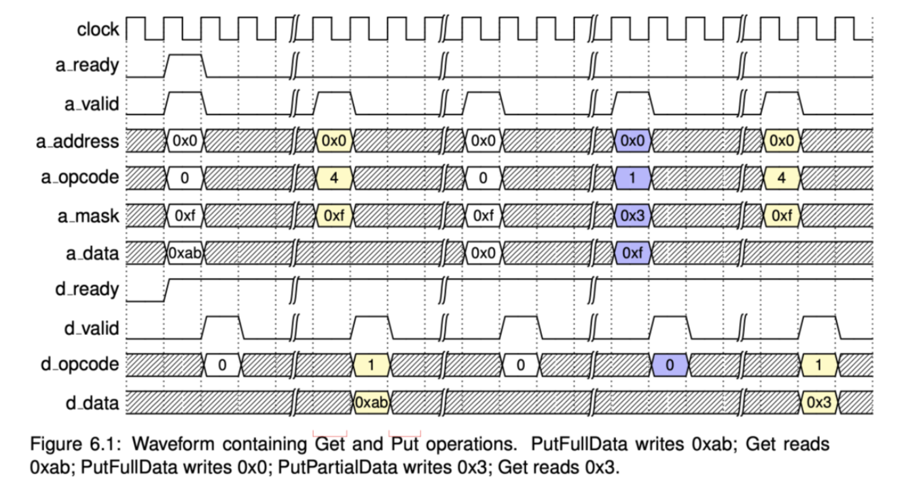

# Lab 3: Creating a TileLink Adapter 

## Overview

So far, we have created a condensed single-file version of our CPU core and created a blackbox to use that Verilog core in a Chisel environment. While we have created this file in our generator folder, it is not actually tied to the rest of the system in any way. 

We have mapped the top-level Verilog signals of the CPU to Chisel signals. That means we now have access to our CPU interface. But does this interface correspond to what Chipyard expects to see connected to its buses? To find out, we will make use of a protocol called TileLink. Where discrepancies arise, we can write "adapter" Chisel to map one interface to another. That's the TileLink adapter. 


## TileLink Introduction

(_This segment partially borrows from the Spring 2024 EE290 Hardware for Machine Learning Lab 5 written by Dima Nikiforov._)

TileLink is the cache coherence and memory protocol used by RocketChip and other Chipyard generators.
It is how different modules like caches, memories, peripherals, and DMA devices communicate with each
other.

RocketChip’s TileLink implementation is built on top of Diplomacy, a framework for exchanging
configuration information among Chisel generators in a two-phase elaboration scheme. For a detailed
explanation of Diplomacy, see the paper by Cook, Terpstra, and Lee (https://carrv.github.io/2017/papers/cook-diplomacy-carrv2017.pdf). Diplomacy is a complicated idea and we do not expect you
to understand it fully for this lab.

Diplomacy represents the different components of an SoC as nodes of a directed acyclic graph.
TileLink nodes can come in several different types. The three main types are: Client, Manager, and
Register. In this lab, we will play with Client and Register nodes.

### Register Nodes

Memory-mapped devices generally follow a common pattern. They expose a set of registers to the
CPUs. By writing to a register, the CPU can change the device’s settings or send a command. By
reading from a register, the CPU can query the device’s state or retrieve results. Register nodes are
similar in construction to the manager nodes with additional logic to make manager nodes work as
MMIO registers interface. They initiate TileLink transactions by sending requests on the A channel and
receive responses on the D channel. In Chipyard, the register node can be instantiated in Chisel as shown
below:

(Check the code in Lab_3_Materials/VerilogTLDevice.scala -> normally it would be in a directory like `generators/chipyard/src/main/scala/example/`)

```
val ctrlNode = TLRegisterNode(
address = Seq(AddressSet(params.ctrlAddress, 4096-1)),
device = device,
beatBytes = 8)
```

In Verilog, this looks like the interface shown below:

(Check the code in Lab_3_Materials/ExampleVerilogTL.v -> normally it would be in a directory like `generators/chipyard/src/main/resources/vsrc/`)


```
output tl_ctrl_a_ready,
input tl_ctrl_a_valid,
input [2:0] tl_ctrl_a_bits_opcode,
input [2:0] tl_ctrl_a_bits_param,
input [CTRL_SIZE_BITS-1:0] tl_ctrl_a_bits_size,
input [CTRL_SOURCE_BITS-1:0] tl_ctrl_a_bits_source,
input [CTRL_ADDR_BITS-1:0] tl_ctrl_a_bits_address,
input [(CTRL_DATA_BITS/8)-1:0] tl_ctrl_a_bits_mask,
input [CTRL_DATA_BITS-1:0] tl_ctrl_a_bits_data,
input tl_ctrl_a_bits_corrupt,
input tl_ctrl_d_ready,
output tl_ctrl_d_valid,
output [2:0] tl_ctrl_d_bits_opcode,
output [1:0] tl_ctrl_d_bits_param,
output [CTRL_SIZE_BITS-1:0] tl_ctrl_d_bits_size,
output [CTRL_SOURCE_BITS-1:0] tl_ctrl_d_bits_source,
output [CTRL_SINK_BITS-1:0] tl_ctrl_d_bits_sink,
output tl_ctrl_d_bits_denied,
output [CTRL_DATA_BITS-1:0] tl_ctrl_d_bits_data,
output tl_ctrl_d_bits_corrupt,
```

If you look at the examples, note that the specifics are for a DMA (direct memory access) device, not your CPU. So don't blindly copy everything!

### Client Nodes

TileLink clients are modules that initiate TileLink transactions by sending requests on the A channel
and receive responses on the D channel. Since we are focusing on non-coherent requests/responses in
this lab, the other channels of TL (BCE) are not included. A client node can be instantiated in chipyard
by using the following code:

(Check the code in Lab_3_Materials/VerilogTLDevice.scala -> normally it would be in a directory like `generators/chipyard/src/main/scala/example/`)

```
val clientNode = TLClientNode(Seq(TLMasterPortParameters.v1(Seq(TLClientParameters(
name = params.deviceName,
sourceId = IdRange(0, (1 << params.clientIdBits)))))))
```

This boils down to the interface listed below:

(Check the code in Lab_3_Materials/VerilogTLDevice.scala -> normally it would be in a directory like `generators/chipyard/src/main/scala/example/`)

```
// Client node TileLink interface for data transfer
input tl_client_a_ready,
output tl_client_a_valid,
output [2:0] tl_client_a_bits_opcode,
output [2:0] tl_client_a_bits_param,
output [CLIENT_SIZE_BITS-1:0] tl_client_a_bits_size,
output [CLIENT_SOURCE_BITS-1:0] tl_client_a_bits_source,
output [CLIENT_ADDR_BITS-1:0] tl_client_a_bits_address,
output [(CLIENT_DATA_BITS/8)-1:0] tl_client_a_bits_mask,
output [CLIENT_DATA_BITS-1:0] tl_client_a_bits_data,
output tl_client_a_bits_corrupt,
output tl_client_d_ready,
input tl_client_d_valid,
input [2:0] tl_client_d_bits_opcode,
input [1:0] tl_client_d_bits_param,
input [CLIENT_SIZE_BITS-1:0] tl_client_d_bits_size,
input [CLIENT_SOURCE_BITS-1:0] tl_client_d_bits_source,
input [CLIENT_SINK_BITS-1:0] tl_client_d_bits_sink,
input tl_client_d_bits_denied,
input [CLIENT_DATA_BITS-1:0] tl_client_d_bits_data,
input tl_client_d_bits_corrupt,
```

### Timing Diagram for A and D Channels

The most important point to note from the TL specs is the timing diagram for Get and Put operations.
In this lab, you will be making sure that these are followed as required by the spec. The timing diagram
is shown below for your convenience.




## Tile Setup

### Creating "Parameter Case Classes"

TileLink is not magic - it takes a bit of Chisel overhead to set up your Tile before making use of it. As seen in the [6.4. Adding a custom core](https://chipyard.readthedocs.io/en/stable/Customization/Custom-Core.html#create-tile-class) documentation, after the [6.4.1. Wrap Verilog Module with Blackbox](https://chipyard.readthedocs.io/en/stable/Customization/Custom-Core.html#wrap-verilog-module-with-blackbox-optional) step, you need to [6.4.2. Create Parameter Case Classes](https://chipyard.readthedocs.io/en/stable/Customization/Custom-Core.html#create-parameter-case-classes). These will help define the "traits" of your Tile and core. 

**(1) Create a brand new scala file for your Tile.**

For consistency, you may want to place it in `YOUR_GENERATOR/src/main/scala/` and name it something like `OFOTile.scala`, where OFOTile is the name of your Tile. 

**(2) Add your Chisel imports.**

Here your list may look like:
```
import chisel3._
import chisel3.util._
import freechips.rocketchip.diplomacy._
import freechips.rocketchip.tilelink._
import freechips.rocketchip.tile._
import freechips.rocketchip.util._
import org.chipsalliance.cde.config.{Parameters, Field, Config}
import freechips.rocketchip.subsystem._
import freechips.rocketchip.prci.ClockSinkParameters
import chisel3.util.log2Ceil
import freechips.rocketchip.rocket.LoadGen
```
(Don't forget to also have basic imports in your blackbox!)

**(3) Create Parameter Case Classes**

Here we are just following along with the documentation. When your core is generated, it will make use of  ``TileParams``, a trait containing the information needed to create a Tile. 

The Rocket Core example is pretty lengthy. You can use 
```
case class NAMEOFYOURTileParams(
    val baseName: String = "NAMEOFMYCORE",
    val clockSinkParams: ClockSinkParameters = ClockSinkParameters(),
    val uniqueName: String,
    val memStart: UInt,
    val tileId: Int,
    val core: NAMEOFMYCoreParams,
    val blockerCtrlAddr: Option[BigInt] = None,
    val btb: Option[freechips.rocketchip.rocket.BTBParams] = None,
    val dcache: Option[freechips.rocketchip.rocket.DCacheParams] = None,
    val icache: Option[freechips.rocketchip.rocket.ICacheParams] = None
) extends InstantiableTileParams[NAMEOFYOURTile] {
  def instantiate(
      crossing: freechips.rocketchip.subsystem.HierarchicalElementCrossingParamsLike,
      lookup: LookupByHartIdImpl
  )(implicit p: Parameters): NAMEOFYOURTile = {
    new NAMEOFYOURTile(this, crossing, lookup, p)
  }
}
``` 

Try to understand some of these Params. For example, `dcache` and `icache` should be familiar here. Why may we set them to `None`?

**(4) Create `CanAttachTile` Class**

As the doc mentions, you will also need to add a `CanAttachTile` class to add the Tile config into the config system. As above, change the documentation example to correspond to your names: 

```
case class MyTileAttachParams(
  tileParams: MyTileParams,
  crossingParams: RocketCrossingParams
) extends CanAttachTile {
  type TileType = MyTile
  val lookup = PriorityMuxHartIdFromSeq(Seq(tileParams))
}
```

And change `RocketCrossingParams` to `freechips.rocketchip.subsystem.HierarchicalElementCrossingParamsLike` since we are not using Rocket. 

### Create a Tile

Creating parameters for a Tile is silly if we don't make a Tile that makes use of them, right? So next, you will need to implement a tile class for your core. This will additionally specify the connections with other diplomatic nodes (recall the Diplomacy graph shown in lecture, with diplomatic nodes and edges). This Tile class will mostly include TileLink connections.


**(1) Steal the documentation's MyTile example**

Add it to your file. Gotta love useful templates. Again, personalize it to your project, particularly:

- Rename `MyTile` and `MyTileParams`
 
- Rename the default `cpuDevice`, such as to your project name

- Comment out `nextLevelCacheProperty ++` (we ran into bugs when this was left in)

```
class MyTile(
  val myParams: MyTileParams,
  crossing: ClockCrossingType,
  lookup: LookupByHartIdImpl,
  q: Parameters)
  extends BaseTile(myParams, crossing, lookup, q)
  with SinksExternalInterrupts
  with SourcesExternalNotifications
{

  // Private constructor ensures altered LazyModule.p is used implicitly
  def this(params: MyTileParams, crossing: HierarchicalElementCrossingParamsLike, lookup: LookupByHartIdImpl)(implicit p: Parameters) =
    this(params, crossing.crossingType, lookup, p)

  // Require TileLink nodes
  val intOutwardNode = None
  val masterNode = visibilityNode
  val slaveNode = TLIdentityNode()

  // Implementation class (See below)
  override lazy val module = new MyTileModuleImp(this)

  // Required entry of CPU device in the device tree for interrupt purpose
  val cpuDevice: SimpleDevice = new SimpleDevice("cpu", Seq("my-organization,my-cpu", "riscv")) {
    override def parent = Some(ResourceAnchors.cpus)
    override def describe(resources: ResourceBindings): Description = {
      val Description(name, mapping) = super.describe(resources)
      Description(name, mapping ++
                        cpuProperties ++
                        nextLevelCacheProperty ++
                        tileProperties)
    }
  }

  ResourceBinding {
    Resource(cpuDevice, "reg").bind(ResourceAddress(tileId))
  }

  // TODO: Create TileLink nodes and connections here.
}
```

### Connect TileLink Buses

"If your core doesn’t use TileLink, you will need to insert converters between the core’s memory protocol and TileLink within the Tile module in the tile class." Our Verilog core does not use TileLink. But nor does it use AXI4, so we can't blindly copy the example from the docs. 

Instead, you can use this snippet taken from another Scala file, in the ``// TODO: Create TileLink nodes and connections here.`` space:

```
 // referencing sodor_tile.scala
 tlOtherMastersNode := tlMasterXbar.node
 masterNode :=* tlOtherMastersNode
 DisableMonitors { implicit p => tlSlaveXbar.node :*= slaveNode }
```

**(1) Use the snippet above to establish a bus crossbar.**

Note that while the Chisel still uses outdated vocabulary, you will also see `client` and `manager` in the docs. Recall the "crossbar" all-to-all interconnect type, referred to as "Xbar" here.

**(2) You will then want to add the client node.**

Again, instead of using the AXI4 (a different protocol) example, we make our own. Modify the `name` in the example to fit your core. 

```
 val memoryTap =
  TLIdentityNode() // Every bus connection should have their own tap node

 // # of bits used in TileLink ID for master node. 4 bits can support 16 master nodes, but you can have a longer ID if you need more.
 val idBits = 4

 // Define a TL client node for our core
 val clientNode = TLClientNode(
   Seq(
     TLMasterPortParameters.v2(
       Seq(
         TLMasterParameters.v2(
           name = "test-ofo-core-client-node",
           sourceId = IdRange(0, idBits),
           requestFifo = true,
         ))
       ),
     )
   )

 // play nice with the default TL bus size
 tlMasterXbar.node  :=
   TLWidthWidget(128/8) :=
     clientNode

```

The client node code is taken from [TileLink Node Types](https://chipyard.readthedocs.io/en/stable/TileLink-Diplomacy-Reference/NodeTypes.html#node-types). In particular, we are making use of these arguments:

- The `name` argument identifies the node in the Diplomacy graph. It is the only required argument for TLClientParameters.

- The `sourceId` argument specifies the range of source identifiers that this client will use. [If we would] have set the range to [0, 4) here, this client will be able to send up to four requests in flight at a time. Each request will have a distinct value in its source field. The default value for this field is IdRange(0, 1), which means it would only be able to send a single request inflight.

- The `requestFifo` argument is a boolean option which defaults to false. If it is set to true, the client will request that downstream managers that support it send responses in FIFO order (that is, in the same order the corresponding requests were sent).

### Create Implementation Class

What we did so far was implicity working with a "LazyModule", which executes before all hardware gets elaborated (and is often where we'll connect a TileLink node to a crossbar). A module implementation trait is the second type of trait in Rocket Chip and often depends on the LazyModule. Similarly, we now need an implementation class to contain the actual hardware we'll be working with. 

The documentation reads: "This class will normally contains Chisel RTL code. If your core is in Verilog, you will need to instantiate the black box class that wraps your Verilog implementation and connect it with the buses and other components." That sounds like us! Our hardware is in a black box.

**(1) Create an implemention class.**

Use the template in the documentation! Don't forget to change names where appropriate.

```
class MyTileModuleImp(outer: MyTile) extends BaseTileModuleImp(outer){
  // annotate the parameters
  Annotated.params(this, outer.myParams)

  // TODO: Create the top module of the core and connect it with the ports in "outer"

  // If your core is in Verilog (assume your blackbox is called "MyCoreBlackbox"), instantiate it here like
  //   val core = Module(new MyCoreBlackbox(params...))
  // (as described in the blackbox tutorial) and connect appropriate signals. See the blackbox tutorial
  // (link on the top of the page) for more info.
  // You can look at https://github.com/ucb-bar/cva6-wrapper/blob/master/src/main/scala/CVA6Tile.scala
  // for a Verilog example.

  // If your core is in Chisel, you can simply instantiate the top module here like other Chisel module
  // and connect appropriate signal. You can even implement this class as your top module.
  // See https://github.com/riscv-boom/riscv-boom/blob/master/src/main/scala/common/tile.scala and
  // https://github.com/chipsalliance/rocket-chip/blob/master/src/main/scala/tile/RocketTile.scala for
  // Chisel example.

}
  ```

Note that this implementation class was already mentioned in your code above, so you'll need to make sure that instantiation matches! Change this segment of your code as needed:

```
// Implementation class (See below)
  override lazy val module = new MyTileModuleImp(this)
```

**(2) Instantiate Your Black Box**

A comment in the example reads, "If your core is in Verilog (assume your blackbox is called "MyCoreBlackbox"), instantiate it here.." You indeed want to do that. It may look something like:

```
val core = Module(
    new NameOfMyBlackBox(outer.params.core)
  )
```

**(3) Double check your work**

"If you create an AXI4 node (or equivalents), you will need to connect them to your core." We did create a node above, although not AXI4. So we'll need to create explicit connections. There's a few other things missing from our setup too, but before that, make sure you have all the main components. Your file should look something like:

```
import chisel3._
import chisel3.util._
import freechips.rocketchip.diplomacy._
import freechips.rocketchip.tilelink._
import freechips.rocketchip.tile._
import freechips.rocketchip.util._
import org.chipsalliance.cde.config.{Parameters, Field, Config}
import freechips.rocketchip.subsystem._
import freechips.rocketchip.prci.ClockSinkParameters
import chisel3.util.log2Ceil
import freechips.rocketchip.rocket.LoadGen

case class OFOTileParams(
  // Code here
}

class OFOTile(
  // Code here
}

// referencing the 'adding a custom core' chipyard tutorial
class OFOTileImp(outer: OFOTile) extends BaseTileModuleImp(outer) {
  // Code here
}

case class OFOTileAttachParams(
  // Code here
}
```

## Connecting the Interfaces

Code from this segment will reside in ``MyTileModuleImp`` (or your equivalent). 

Recall the TileLink introduction and lecture overview. We have two interfaces we have to map: the client TileLink interface (A and D channels only) - since that's the node we added above - and the EECS151 CPU memory interface. This memory interface was given to you as the interface of a cache, `Cache.v`, if you took the Spring 2024 (and most other) implementations of the ASIC Lab. You used cache lines that are 512 bits (16 words). The memory interface is 128 bits, meaning that you require multiple (4) cycles to perform memory transactions. In summary, the signals of your interface probably look like:


The Client node TileLink interface Chipyard will expect is: 

```
// Client node TileLink interface for data transfer
input tl_client_a_ready,
output tl_client_a_valid,
output [2:0] tl_client_a_bits_opcode,
output [2:0] tl_client_a_bits_param,
output [CLIENT_SIZE_BITS-1:0] tl_client_a_bits_size,
output [CLIENT_SOURCE_BITS-1:0] tl_client_a_bits_source,
output [CLIENT_ADDR_BITS-1:0] tl_client_a_bits_address,
output [(CLIENT_DATA_BITS/8)-1:0] tl_client_a_bits_mask,
output [CLIENT_DATA_BITS-1:0] tl_client_a_bits_data,
output tl_client_a_bits_corrupt,
output tl_client_d_ready,
input tl_client_d_valid,
input [2:0] tl_client_d_bits_opcode,
input [1:0] tl_client_d_bits_param,
input [CLIENT_SIZE_BITS-1:0] tl_client_d_bits_size,
input [CLIENT_SOURCE_BITS-1:0] tl_client_d_bits_source,
input [CLIENT_SINK_BITS-1:0] tl_client_d_bits_sink,
input tl_client_d_bits_denied,
input [CLIENT_DATA_BITS-1:0] tl_client_d_bits_data,
input tl_client_d_bits_corrupt,
```

We need to figure out:
- How to map EECS151 memory interface signals to TL client signals
- Identify key differences in expected behavior
- How to connect and create FSM logic to convert between them as needed  

**(1) First, take some time to understand the two interfaces.**

Try the table or waveform methods mentioned in lecture! Or you can just reason it out..

Use that to motivate the rest of your implementation. There are multiple steps to actually doing so. Below we provide one approach.

### Implementation Class Starter

Here is some starter code for the implementation class, if you choose to use it:
```
{
  // Black Box Instantiation
  // YOUR CODE HERE 

  // Useful constants 
  val io = core.io
  val NUM_DATA_CYCLES = 4
  val MEM_REQ_SIZE_BITS = 512
  val MEM_BUS_SIZE_BITS = 128
  // making PC_RESET = 0 so all memory addresses (incl. below 0x2000) from the core are inbound for DRAM
  val MEM_OFFSET = 0x0.U // 0x80000000L.U // - 0x2000.U // map PC_RESET to the start of the DRAM space in tilelink

  // More TileLink setup (again referencing `sodor_tile`)
  require(outer.clientNode.out.size == 1)
  require(outer.clientNode.in.size == 0)
  val (tl_out, edge) = outer.clientNode.out(0)

  // Connect clock and reset
  // YOUR CODE HERE

  // Registers to hold values for the CPU
  // YOUR CODE HERE 

  // Registers to hold values for the request 
  // i.e. store the request when the input port fires to avoid value changes when sending the TileLink request
  // YOUR CODE HERE 
  
  // States of your FSM
  // YOUR CODE HERE 

  // State transition logic
  // YOUR CODE HERE 
  // Example transition (can think of it as blocks in Verilog):
  when(state === NAMEOFSTATE && io.SOMESIGNAL) {
    state := ANOTHERSTATE
    SOMEREGISTER := SOMELOGIC
    SOMEREGISTER := io.SOMESIGNAL
  }
 
  // Other logic 
  // YOUR CODE HERE
  // Example (can think of it like assign statements in Verilog): 
  SOMESIGNAL := SOMELOGIC

  // Build "Get" message (From TileLink SiFive spec)
  val (legal_get, get_bundle) = edge.Get// YOUR CODE HERE
  // Build "Put" message (From TileLink SiFive spec)
  val (legal_put, put_bundle) = edge.Put// YOUR CODE HERE

  // Connect Channel A bundle
  // YOUR CODE HERE

  // Connect Channel D bundle (read result)
  // YOUR CODE HERE 

  // Handle error
  val legal_op = Mux(io.mem_req_rw, legal_put, legal_get)
  val resp_xp = tl_out.d.bits.corrupt | tl_out.d.bits.denied
  // Since the core doesn't have an external exception port, we have to kill it
  assert(legal_op | !tl_out.a.valid, "Illegal operation")
  assert(!resp_xp | !tl_out.d.valid, "Responds exception")

  dontTouch(legal_get)
  // Tie off TileLink unused channels
  tl_out.b.valid := false.B
  tl_out.c.ready := true.B
  tl_out.e.ready := true.B
}
```

This is quite a bit to read through. Here are some suggested steps:

**(1) Connect up clock and reset and reset.asBool**

Recall that Chisel uses an implicit clock!

**(2) Create registers to hold values for the CPU**

It'll be helpful to be organized with your signals. Remember in particular these signals:

- Opcode - Defines type of operation (Get/Put/GetAck/PutAck)
- Size - Defines size of transaction as 2^N bytes
- Address - Target Address in Bytes
- Mask - Bitmask Byte Lanes to Access
- Payload - The data to be written/read

**(3) Build Get and Put messages**

Each of these is a one liner, as you can see in the template, and you can find more information in the (suprisingly readable) SiFive TileLink spec! 

**(4) Mux between these, depending on if it’s a read or write request**

Your template provides some guidance on the kinds of extra logic you may need. 

**(5) With the basics out of your way, build out your FSM!** 

One way you could think about states:

- `Ready`: **Waiting for the core IO to make a valid memory request.**
  - When do you transition out of this state?
  - What happens to `tl_out.a.valid` when you do?  
  - What happens to your memory request info (address, data, etc..)?
  - Which state do you transition to?
- `Active`: **Waiting on TileLink Channel A.**
  - What signal are you waiting on? 
  - Where do you transition when it's true?
- `Inflight`: **Waiting on TileLink Channel D (the response).**
  - What signal are you waiting on? 
  - Where do you transition? Is it different depending on whether you read or write?
  - How do you deal with the memory sizes and 4 cycles? 
    - Recall the "TileLink MultiBeat Messages" slide:
      - All TileLink Messages are composed of “Beats” which are sent one per cycle
      - If your message size is larger than your bus size (Beat Width) you can break it into a MultiBeat message, similar to 151’s 512 bit read over 128 bit bus.
      - However, key issue is that multibeat responses can be interrupted! 
  - `Responding`: **You may want an extra state to deal with the 4 count.**

For a more visual representation of the motivation, you can think more in terms of diagrams:


And pay attention to the waveforms and how can you meet both the 151 and TileLink spec:


There's different ways of doing this design, so feel free to experiment, and let us know if you have questions so that we can improve this lab segment!

# Credits

The introduction borrows from the Spring 2024 EE290 Hardware for Machine Learning Lab 5 written by Dima Nikiforov. 

Useful references:
- Adding a custom core - https://chipyard.readthedocs.io/en/stable/Customization/Custom-Core.html#create-tile-class
- TileLink Node Types - https://chipyard.readthedocs.io/en/stable/TileLink-Diplomacy-Reference/NodeTypes.html#node-types
- "Diplomatic Design Patterns: A TileLink Case Study" i.e. The Diplomacy Paper - https://carrv.github.io/2017/papers/cook-diplomacy-carrv2017.pdf
- SiFive TileLink Specification - https://static.dev.sifive.com/docs/tilelink/tilelink-spec-1.7-draft.pdf

