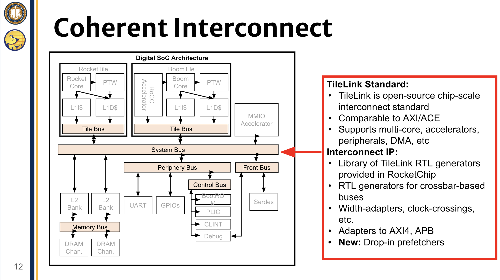
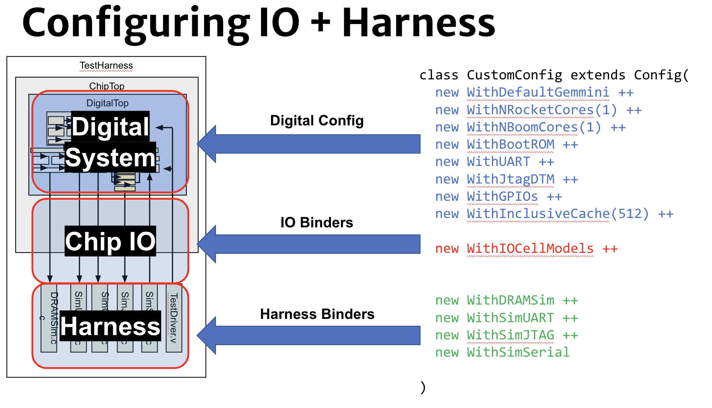

# Lab 4: CPU Integration - Last-ish Steps

## Overview

So far, you learned Chisel, explored Chipyard, created a black box for your core, and create a TileLink Adapter. Now we are closer than ever to integrating your core into the entire SoC - and, to begin with, defining what your SoC will look like!

For example, a sample architecture we considered for this SoC looked like:


Notice how the SoC contains modules you now recognize such as Rocket Core, the TileLink Adapter, common buses..

This lab will switch gears into this broader picture - how does Chipyard bring these architectures to life, while abstracting away much of the complexity and making use of a complex system of scripts (such as SBT files) and Scala constructs (such as mixins)? 

After all, the whole point of TileLink is to have an interconnect for the whole SoC:



While this lab has quite a bit of reading, use it to motivate how you can modify this base design from single core to multi-core, and what the SoC may need to successfully boot up and function. _This is NOT a perfect setup, and we will need to modify it later._ Fun!

## Part 4a: Chipyard SBT Files

### Introduction to SBT

You will find in the documentation: "Chipyard is a complex framework that depends on a mix of build systems and scripts. Specifically, it relies on git submodules, on sbt build files, and on custom written bash scripts and generated files."

Generally, `sbt` (Simple Build Tool) is a command-line build tool for Scala, Java, and more. There are many build tools out there. But what is a build tool?

So far you've been working with just two source files. With only a few Scala files, it's easy enough to compile with `scalac MainFile.scala` in the command line. Chipyard, however, is made up of hundreds of files. A build tool helps manage the complexity of all those compilations. `sbt` is nice becauses it uses a small number of concepts but supports flexible and powerful build definitions. If you want to read more, you can go through the Getting Started guide [here](https://www.scala-sbt.org/1.x/docs/Getting-Started.html), but the level of understanding of `sbt` you need for Chipyard is quite minimal.

An `abt` build file, also known as build.sbt, is a configuration file used to define the structure and dependencies of a Scala project. It lists your source files and relevant information. Then `sbt` reads the file to compile the project. It can also automatically manage dependencies, downloading the versions of the libraries you declare as needed. 

Some key elements of an `build.sbt` file include:

- **Settings**: Customizable build settings, like compiler options, source directories, and output directories.
- **Dependencies**: Lists of libraries and frameworks required by the project.
- **Tasks**: Definitions of build actions, such as compiling, testing, and packaging the project.

In more detail, you may find declarations such as:

**Settings**

- `scalaVersion`: specifies the version of Scala to use for the project.
- `organization`: defines the organization or company responsible for the project.
- `name`: sets the name of the project.
- `version`: specifies the version number of the project.

**Dependencies**

- `libraryDependencies`: defines the dependencies required by the project, such as libraries, frameworks, or plugins. These dependencies are specified using the Maven-style notation (e.g., "org.scala-lang.modules" %% "scala-parser-combinators" % "2.3.0").

One of the examples of a Scala-specific feature is the ability to cross build your project against multiple Scala versions.

**Multi-Project Builds**

- `lazy val`: defines a lazy val, which is a way to define a project or module within the build. (Recall LazyModules from Lab 3!)
- `(project in file("path/to/module"))`: specifies the path to the module or subproject.
- `settings`: defines the settings for the module or subproject.

Here is an example build.sbt file:

````
scalaVersion := "2.13.12"

organization := "ch.epfl.scala"
name := "hello-world"
version := "1.0"

libraryDependencies += "org.scala-lang.modules" %% "scala-parser-combinators" % "2.3.0"
````

This build file defines:

- Scala version 2.13.12
- Organization “ch.epfl.scala”
- Project name “hello-world”
- Version 1.0
- Dependency on scala-parser-combinators version 2.3.0

### SBT in Chipyard

In your the top-level of your Chipyard repository, you will find a `build.sbt` file. It reads similarly to:


````
import Tests._

// This gives us a nicer handle to the root project instead of using the
// implicit one
lazy val chipyardRoot = Project("chipyardRoot", file("."))

// keep chisel/firrtl specific class files, rename other conflicts
val chiselFirrtlMergeStrategy = CustomMergeStrategy.rename { dep =>
  import sbtassembly.Assembly.{Project, Library}
  val nm = dep match {
    case p: Project => p.name
    case l: Library => l.moduleCoord.name
  }
  if (Seq("firrtl", "chisel3").contains(nm.split("_")(0))) { // split by _ to avoid checking on major/minor version
    dep.target
  } else {
    "renamed/" + dep.target
  }
}
````
...

These structures are hinted at in the **Multi-Project Builds** segment above. You can find more information [here in the scala-sbt docs](https://www.scala-sbt.org/1.x/docs/Multi-Project.html). An excerpt:

> It can be useful to keep multiple related subprojects in a single build, especially if they depend on one another and you tend to modify them together.

> Each subproject in a build has its own source directories, generates its own jar file when you run package, and in general works like any other project.

> A project is defined by declaring a lazy val of type Project. For example, :

> lazy val util = (project in file("util"))

> lazy val core = (project in file("core"))

In your top level `build.sbt` file, you will then also find `lazy val commonSettings`:

> Another way to factor out common settings across multiple projects is to create a sequence named commonSettings and call settings method on each project.

```
lazy val commonSettings = Seq(
  target := { baseDirectory.value / "target2" }
)

lazy val core = (project in file("core"))
  .settings(
    commonSettings,
    // other settings
  )

lazy val util = (project in file("util"))
  .settings(
    commonSettings,
    // other settings
  )
```

You will then see, in the ``Subproject definitions``  segment, `Rocket Chip` and `Chipyard-managed External Projects` submodules. Again, you're welcome to read into the documentation, but all of this is simply a way to simplify compilation and dependencies. You are no worse off if you simply pattern match whenever you need to add your own module.

### Your SBT changes 

Speaking of which, that's what we need to do right now!

**(1)** **Add your generator to the Chipyard dependency list**

In the file, find `lazy val chipyard = (project in file("generators/chipyard"))`. Based off the above, what is this line doing?

Add the name of your generator to the `.dependsOn` list.

**(2)** **Add your generator as a Chipyard-managed external project**

Pattern matching how the rest of the `lazy val` submodules are set up, add your generator to the build file:

````
lazy val PROJECT_NAME = (project in file("generators/PROJECT_NAME"))
  .dependsOn(rocketchip)
    .settings(libraryDependencies ++= rocketLibDeps.value)
      .settings(chiselSettings)
        .settings(commonSettings)
````

And that's it! That's a lot of reading for a small change, hence why you don't need to be too familiar with `sbt`. 

## Part 4b: Configs

### Introduction to Configs 


The [1.3. Configs, Parameters, Mixins, and Everything In Between](https://chipyard.readthedocs.io/en/stable/Chipyard-Basics/Configs-Parameters-Mixins.html) documentation does a pretty good job of explaining configs. A few choice segments:

> A significant portion of generators in the Chipyard framework use the Rocket Chip parameter system. This parameter system enables for the flexible configuration of the SoC without invasive RTL changes.

Recall the `Params` from Lab 3!

> A config is a collection of multiple generator parameters being set to specific values. Configs are additive, can override each other, and can be composed of other configs (sometimes referred to as config fragments). The naming convention for an additive config or config fragment is With<YourConfigName>, while the naming convention for a non-additive config will be <YourConfig>. Configs can take arguments which will in-turn set parameters in the design or reference other parameters in the design.

Essentially, Chipyard has a lot of generators, many of which you're now familiar with. How do you configure them all? Configs are a way to take in user requirements and inject them into the generator to configure a particular design. A Config is composed of Config "fragments." “Fragments” set/override/adjust/clear keys in the Config object. Generators (your CPU generator, the Rocket Chip generator, Chipyard generator...) query this “Config” object at runtime to figure out what to do.

> This example shows a basic config fragment class that takes in zero arguments and instead uses hardcoded values to set the RTL design parameters. In this example, MyAcceleratorConfig is a Scala case class that defines a set of variables that the generator can use when referencing the MyAcceleratorKey in the design.

```
class WithMyAcceleratorParams extends Config((site, here, up) => {
  case BusWidthBits => 128
  case MyAcceleratorKey =>
    MyAcceleratorConfig(
      rows = 2,
      rowBits = 64,
      columns = 16,
      hartId = 1,
      someLength = 256)
})
```

If that is confusing, here's an even simpler example. This fragment changes the BankedL2Key to set its nBanks field to the desired number of banks (where banks is a concept in [cache memory](https://en.wikipedia.org/wiki/Memory_bank)):

```
class WithNBanks(n: Int) extends Config((site, here, up) => {
  case BankedL2Key => up(BankedL2Key, site).copy(nBanks = n)
})
```

> This next example shows a “higher-level” additive config fragment that uses prior parameters that were set to derive other parameters.

```
class WithMyMoreComplexAcceleratorConfig extends Config((site, here, up) => {
  case BusWidthBits => 128
  case MyAcceleratorKey =>
    MyAcceleratorConfig(
      Rows = 2,
      rowBits = site(SystemBusKey).beatBits,
      hartId = up(RocketTilesKey, site).length)
})
```

That is, instead of hard coding `rowBits = 64`, we can now reference `SystemBusKey`. The `up` and `site` objects can be quite confusing, but you'll see them show up often, so it's helpful to gain some intuition for what they're doing.

> The site, here, and up objects in WithMyMoreComplexAcceleratorConfig are maps from configuration keys to their definitions. The site map gives you the definitions as seen from the root of the configuration hierarchy (in this example, SomeAdditiveConfig). The here map gives the definitions as seen at the current level of the hierarchy (i.e. in WithMyMoreComplexAcceleratorConfig itself). The up map gives the definitions as seen from the next level up from the current (i.e. from WithMyAcceleratorParams).

Hm...

#### A Bit of a Deeper Look 

At this point, you are likely to get confused. Maps? Keys? Where is all this coming from? The documentation [has a page for these](https://chipyard.readthedocs.io/en/stable/Customization/Keys-Traits-Configs.html#keys-traits-and-configs) that may not be intro friendly. Many people will take the code for granted and pattern match what seems to work until intuition builds up. 

Instead, let's explore the implementation a bit at a more basic level (as described by one of the original developers, Henry Cook). While you won't use it day to day, it might help build much stronger intuition for what the code in front of you is doing.

When talking about configs, the fundamental abstract is called a `View`. A **View** is a **key-value** store or hash map with a special property: when you look up a particular key's value, that value can be based on further lookups, that have other keys. This is powerful because when you want to see the value of a certain parameter, it can be derived based off other parameters. This also lets you override values as you pass this object through the hierarchy of generators. So you can pass it off to the a subsystem generator, which can modify some of the keys or values before passing it off to the Tile generators, or passing it off to the NoC generator, or passing it off to our CPU generator, etc...

If you look at the `config` library (which is a utility library or `package`, just like `util`, `regmapper`, `diplomacy` as you'll see around Chipyard), you will actually see a class called `View`. And within those, you will see the subclasses `Parameters` and `Configs`. 

Generally:
- `Views` are dynamically-scoped key-value stores
- `View` -> `Parameters` will supply an API for altering Views with `up`, `site`, `here`...
- `View` -> `Configs` will supply an API for composing Views

Originally the `Configs` library was meant to be for top-level and `Parameters` for passing through the design to different generators, but by the time the developers realized they're doing the same thing it was too late to refactor everything and combine the two slightly different APIs... So if you're still confused about the difference, you're not alone! The difference is - no one had the time to do a mass system redesign..

With this background, let's revisit another simple example:
```
class WithNExtInterrupts(nExt: Int) extends Config {
  (site, here, up) => {
    case NExtInterrupts => nExt
  }
}

class MyConfig extends Config (
  new WithNExtInterrupts(16) ++ 
  new DefaultSmallConfig
  )
```

Recall that with `Views`, there's keys and values you can look up. When you do a look-up, you are matching in these `case`s looking for a certain key. The `key` here is the number of [external interrupts](https://www.geeksforgeeks.org/external-and-internal-interrupts/). It returns a value which is an integer (`Int`). 

So this snippet is making an instance of the class `Config`, that we described above, and parametrizing it with the number of external interrupts `nExt`, which in of itself is parametrized. The result is a `Config` class that sets this key to that integer. You can then combine these `Config` classes with each other to create much more complicated `Config` objects.

For example, here we've added a second `Config`, `MyConfig` which takes in an existing Config `DefaulSmallConfig` - which presumably already has a bunch of keys and values set in it - and we modify it by composing it. The resulting Config is now altered with the new `WithNExtInterrupts` Config which defines the number of interrupts. The default of `MyConfig` will be the `DefaultConfig` with the number of interrupts set to 16.

Note this point in the documentation:

> The following example shows a non-additive config that combines or “assembles” the prior two config fragments using ++. The additive config fragments are applied from the right to left in the list (or bottom to top in the example). Thus, the order of the parameters being set will first start with the DefaultExampleConfig, then WithMyAcceleratorParams, then WithMyMoreComplexAcceleratorConfig.

```
class SomeAdditiveConfig extends Config(
  new WithMyMoreComplexAcceleratorConfig ++
  new WithMyAcceleratorParams ++
  new DefaultExampleConfig
)
```

This is very similar to what we just did! The main additional takeaway is that the order of the Configs matters. 


There's very many different core / accelerator / peripheral / memory-system / etc configurations. Every single generator we've talked about can be configured (that's the point of "parametrizable"!) Some other examples include:

- Custom interfaces to off-chip memory (Serdes/QSPI/DDR)
- APIs for integrating PLLs, setting up clock muxes/dividers
- Clock-domain construction + CDC APIs
- Integration with analog device models
- Coherent/incoherent memory architectures



You can actually list most of the available Config options across all Chipyard packages using ``make find-config-fragments``. 

For example ([xcelium](https://www.cadence.com/en_US/home/tools/system-design-and-verification/simulation-and-testbench-verification/xcelium-simulator.html) is just another logic sim tool):
```
cd $CHIPYARD_DIRECTORY/sims/xcelium
make find-config-fragments
```

**In summary, if you look around Chipyard, you will find many files that define these `Config` objects and provide named settings. Then there's additional settings that combine those partial Configs into complete configurations that supply all the key-value pairs needed to generate a particular design. That's how the nested key-value hierarchy works!**

#### Are you tired of reading yet?..

There's more complexity to be found here of course, for the determined.. 

The way this works is that Scala has the notion of a partial function - a function only defined for some values. In this case, the places where the function is defined are the keys that are supplied. If you look up a key, Scala will go and try to match that key to something in that partial function. 

So it will go through it and evaluate a bunch of case statements, and check - "Does this match? Does this match? Does this match?" - until it finds the key that does match. So even if this `DefaultSmallConfig` had a `case NExtInterrupts => 1`, because of how we've composed `MyConfig`, when I look up external interrupts I will find the new case first and that will become the value you get. Hence why we compose in a way that makes sure the foremost value is first. 

The other part, is that instead of having this particular `Int` `nExt`, you can use `site`, `here`, and `up` functions to look up a different parameter. You can set `NExtInterrupts` to be equal to another key, such as what the number of [PLIC interrupts](https://five-embeddev.com/riscv-priv-isa-manual/Priv-v1.12/plic.html) that this Config supports is.

**In summary, you are able to overlay keys, replace what was there previously, and have keys that look up other keys. And you can comvine those together to do stuff that is "probably slightly too fancy", in Henry's words..**

#### "Mixins" and the Cake analogy

You can glaze over `Views` and `keys` if they don't help you, but do glance at the [1.3.3. Cake Pattern / Mixin](https://chipyard.readthedocs.io/en/stable/Chipyard-Basics/Configs-Parameters-Mixins.html#parameters) documentation. Some excerpts:

> A cake pattern or mixin is a Scala programming pattern, which enable “mixing” of multiple traits or interface definitions (sometimes referred to as dependency injection). It is used in the Rocket Chip SoC library and Chipyard framework in merging multiple system components and IO interfaces into a large system component.

The term cake may come up in conversation, and you want to be braced for the unhappy surprise that people are not discussing free cake leftover in the kitchen. `:(`

> The lazy module defines all the logical connections between generators and exchanges configuration information among them, while the lazy module implementation performs the actual Chisel RTL elaboration.

As we finish up focusing on the core, understanding `class DigitalTop` (and in turn, what's actually part of your SoC by default) is increasingly important.  

But for now, let's move on from readings!

### Your Custom Core Config

From Lab 3, you should now have a Scala file (`OFOTile.scala` or such) containing:

```
case class OFOTileParams(
  // Code here
}

class OFOTile(
  // Code here
}

// referencing the 'adding a custom core' chipyard tutorial
class OFOTileImp(outer: OFOTile) extends BaseTileModuleImp(outer) {
  // Code here
}

case class OFOTileAttachParams(
  // Code here
}
```

You now have a Tile (diplomacy code), instantiate the Tile Implementation (hardware code), parametrize the Tile, and use a `CanAttachTile` class which we said is to add the Tile config into the config system. This `CanAttachTile` is nice, because we can connect the Tile directly to the other diplomacy nodes. But as the name suggests, `CanAttachTile` is not `PleaseAttachMyTileNow` (which is not a real class). That is, we need an extra Config class to actually attach the Tile to the rest of the system. This will be your next task. 

**(1)** **Create a new file to hold your Config**

In the same `scala` directory as your other Scala files, create a new file (such as `generators/MY_CORE/src/main/scala/OFOConfigs.scala`).

While we could technically put everything into the `OFOTile.scala` file (or your equivalent) of Lab 3, it's cleaner to split them up.

**(2)** **Set up the file**

This means:

- Add `package my_generator_name` to the top of your file, as you should have in your other Scala files as well. (We very briefly mentioned packages in the explanation above.)

- Import your Tile with a declaration such as `import my_generator_aka_my_package_name.OFOTile`. (Now that we have more files, we need to be more careful with our imports.)

- Import the standard dependencies. 

In this case, the standard dependencies may mean:

```
import chisel3._
import chisel3.util._
import org.chipsalliance.cde.config._
import freechips.rocketchip.devices.debug._
import freechips.rocketchip.devices.tilelink._
import freechips.rocketchip.diplomacy._
import freechips.rocketchip.rocket._
import freechips.rocketchip.tile._
import freechips.rocketchip.util._
import freechips.rocketchip.subsystem._
```

**(3)** **Set up the `Config` template**

Recall the `WithNExtInterrupts` example (or any other example you'd like to look at.) Now that you understand nested configs, we'd like to make some `WithMyCore(s)` Config to use.

In other words, in the `OFOTile`, you created busses, a TileLink client, and set up your interface. Now the `WithOFOCores` (`With_MY_GENERATOR_Cores`) mixin will set the design cues to instantiate your core and create diplomacy connections to the TileLink bus. 


```
class With_MY_GENERATOR_Cores(cores: Seq[MY_CORE_PARAMS]) extends Config((site, here, up) => {
  case TilesLocated(InSubsystem) => {

    // Calculate the next available hart ID (since hart ID cannot be duplicated)

    // Update the TilesLocated design key

    // Create TileAttachParams for every core to be instantiated
  
  }

  // Number of instruction bits 

  // Iterate on number of Tiles
}

) {

  // Requirements 

}
```

Make sure you are using the names that make sense for your project, such as pulling `MY_CORE_PARAMS` from the `val core:` you wrote in your `TileParams` class. 

#### Complete the `With_MY_GENERATOR_Cores` Config

If you'd really like, you can try reading the documentation and doing this yourself in some better way. However, this particular setup is pretty unique to the scenario of adding custom cores to the SoC, so we've tried to implement it for you instead. **Note that this setup does not yet work for multicore, so think critically about every step - how can you help make the transition?** What is currently missing? This is part of the reason why there's so many explanations at every line.

**(1)** **Calculate the next available hart ID** 

The word `hart` (HARdware Thread) will come up often in the context of RISC-V architecture. It is an abstraction of a hardware thread, capturing the essential aspects of a real hardware thread for the purposes of defining the RISC-V specifications. Cool. But what does that mean?

- A hart executes instructions independently from other harts in a RISC-V system.

- Each hart has its own set of architectural registers.

- Harts are not necessarily physical hardware threads, but rather an abstraction that can be implemented in various ways, such as through multithreading or simultaneous multithreading (SMT).

- A hart does not have its own independent instruction fetch unit, unlike a core, which contains an independent instruction fetch unit.

Seen a different way:

- From a software perspective, each hart appears as an independent processor, with its own registers and execution units, fetching instructions from memory.

- From a hardware perspective, multiple harts in a core may share some resources, such as the instruction fetch unit.

And in a summary, a `hart` executes instructions independently, with its own registers and execution context, and can be implemented through various mechanisms, including multithreading and SMT. It encapsulates the idea of anything that has its own program counter, register state, and execution thread.

In RISC-V, each hart needs its own ID. We can use a variable `idOffset` to find the next (counting up) available ID.

This is a lot of new information for one lines of code, so you can simply copy and paste the following:

```
// Calculate the next available hart ID (since hart ID cannot be duplicated)
val idOffset = up(NumTiles)
```

**(2)** **Update the TilesLocated design key**

Add this line to have the TilesLocated design key also include your CPU. 

This is used to tell diplomacy that it needs to instantiate your core.  

(Note: we may need to add a better explanation here.. but for now, this is another freebie.)

```
// Update the TilesLocated design key
val prev = up(TilesLocated(InSubsystem))
```

**(3)** **Create TileAttachParams**

You can do this once, but thinking ahead to our multi-core goals, we want to do this for _each_ core.
Again we give you some code (which may need to be modified later for multi-core - note the address offset TODO):

```
// Create TileAttachParams for every core to be instantiated
    cores.zipWithIndex.map { case (core, idx) =>
      OFOTileAttachParams( // TODO figure out address offset
        tileParams = OFOTileParams(tileId = idx + idOffset, memStart=0.U, core=core, uniqueName=core.projectName),
        crossingParams = RocketCrossingParams()
      )
    } ++ prev
```

What is this doing?

- `cores: Seq[MY_CORE_PARAMS]` grabs your core (currently one), puts it in a sequence (list), and that becomes the value of `cores`. 

- `zipWithIndex` zips `cores` as a tuple of its indices and cores (currently just one).

- For each tuple `(core, idx)`, run `OFOTileAttachParams`, or your equivalent.

- In addition to specifying the `OFOTileParams`, specify `crossingParams`, which is the type of crossing between the core and system bus.*

*In some cases, you may want your core running at a higher frequency than the system bus, and you'd need a [clock crossing](https://en.wikipedia.org/wiki/Clock_domain_crossing). As default we use `RocketCrossingParams()` (which iirc, just uses current the current Rocket configuration - but it's not in the documentation - you'd need to read the RTL to find out and tell me...) 

**(4)** **Set the number of instruction bits**

XLen sets the register length - it's a configuration key that specifies this is a RV-? core.
This is probably 32 (RISC-V32) for you:

```
// The # of instruction bits. Use maximum # of bits if your core supports both 32 and 64 bits.
case XLen => 32
```

**(5)** **Iterate on number of tiles**

Does this syntax slowly start making sense to you?

```
// Iterate on number of Tiles
case NumTiles => up(NumTiles) + cores.size
```

**(6)** **Place a requirement (or fix this setup to work for multi-core)?**

As of this writing, we don't yet have a solid system for combining the cores. This is another spot for you to experiment!
But until that is fixed, you can use the `require` syntax for enforce that the list `cores: Seq[MY_CORE_PARAMS]` is only one core long. 

```
// Requirements
require(cores.size == 1, "This project doesn't _currently_ support multiple core.")
```

This is a helpful construct you will recognize in different parts of Chipyard. Some more examples:

``require(dp(ClockInputOverlayKey).size >= 1)``

``require(config.size % blockBytes == 0)``

### Fire Off to Top Level! 

#### Introduction to Rocket Config 

It's great that we have this Config, but it's not yet nested into a top-level Config, so it's not being used. Recall your overview of [1.3. Configs, Parameters, Mixins, and Everything In Between](https://chipyard.readthedocs.io/en/stable/Chipyard-Basics/Configs-Parameters-Mixins.html) earlier. There's somewhat of an explanation of Rocket Chip Configs in [3.9. Rocket-Chip Generators](https://chipyard.readthedocs.io/en/stable/Generators/Rocket-Chip-Generators.html), but it'll be easier to understand by looking at the Scala itself. 

Navigate to:

```generators/chipyard/src/main/scala/config/RocketConfigs.scala```

Here you will find multiple complete Rocket Chip SoC configurations, including the vary basic:

```
// --------------
// Rocket Configs
// --------------

class RocketConfig extends Config(
  new freechips.rocketchip.subsystem.WithNBigCores(1) ++         // single rocket-core
  new chipyard.config.AbstractConfig)

class TinyRocketConfig extends Config(
  new chipyard.harness.WithDontTouchChipTopPorts(false) ++        // TODO FIX: Don't dontTouch the ports
  new testchipip.soc.WithNoScratchpads ++                         // All memory is the Rocket TCMs
  new freechips.rocketchip.subsystem.WithIncoherentBusTopology ++ // use incoherent bus topology
  new freechips.rocketchip.subsystem.WithNBanks(0) ++             // remove L2$
  new freechips.rocketchip.subsystem.WithNoMemPort ++             // remove backing memory
  new freechips.rocketchip.subsystem.With1TinyCore ++             // single tiny rocket-core
  new chipyard.config.AbstractConfig)

```

The annotations are your good friends! From the names, you can tell this is the last line of defense (offense?) for selecting what your SoC is going to look like. This is your last chance to select the number of cores (the default "core" referred to is Rocket Core), your memory structure, prefetchers, accelerators, and much more, before declaring which top-level Config you will use.

Pay special attention to `AbstractConfig`. The `AbstractConfig` is the most generic default, that sets up the SoC in a "mostly sane" way. For example, it sets up:

- The five traditional TileLink buses (S system, P peripheral, C control, M memory, F front bus)

- Peripherals such as UART (communication) and JTAG (debugging)

- A 64kB scratchpad (on-chip memory) off the S-bus (system bus)

Etc. This default is invaluable and part of the reason why you can create a whole SoC without understanding every detail of it!

#### Creating your SoC Configuration

**(1)** **Copy over the Rocket Configs template**

At the bottom of ```generators/chipyard/src/main/scala/config/RocketConfigs.scala```, create a new Config. For now we recommend starting with a setup such as (the name can be changed):

```
class MY_BEST_IN_THE_WORLD_RocketConfig extends Config(
        // Include my new generator core(s) with my CoreParams passed in

        // Include one tiny Rocket Core

        // Remove the scratchpad

        new testchipip.serdes.WithSerialTLMem(size = MAGIC_NUMBER) ++ // Configure the off-chip memory accessible over serial-tl as backing memory

        // Remove off-chip AXI port (referred to as just MemPort)

        new testchipip.soc.WithOffchipBusClient(freechips.rocketchip.subsystem.MBUS) ++ // off-chip bus connects to MBUS to provide backing memory

        // Attach off-chip bus

        new chipyard.config.WithBroadcastManager ++ // Replace L2 with a broadcast hub for coherence

        // The most generic SoC default configuration to inherit from
)
```

**(2)** **Fill out the template** 

Unlike the previous Config we made, this is a very common setup, so we'd like you to do it yourself! You should have nine lines of configuration in this Config. You can fill them out in any order, but each is one line.

**// Include my new generator core(s) with my CoreParams passed in**

This is where you want to add your generator (at the very top so nothing overwrites it)! Note how in other examples, `testchipip`, `config`, etc, are packages. You also have a package. You also have `Params` you pass into your `With` Config. 

How might you use this information?

**// Include one tiny Rocket Core**

You can reference some of the other Configs for how to do this. We would like a Rocket Core as a proven working core on the SoC, that can also help us with interrupt and boot handling. But a smaller Rocket core will make place and route easier.

**// Remove the scratchpad**

A scratchpad is a type of on chip memory: [https://en.wikipedia.org/wiki/Scratchpad_memory](https://en.wikipedia.org/wiki/Scratchpad_memory). For now we'd like to remove it, as we are not using it and don't know if it'll work in SKY130.

**new testchipip.serdes.WithSerialTLMem(size = MAGIC_NUMBER) ++ // Configure the off-chip memory accessible over serial-tl as backing memory**

This is for off-chip memory. Set it to one gigabyte. Hint: you may want to use a format like `(size = (A << B) * C)`. What might this mean?

**// Remove off-chip AXI port (referred to as just MemPort)**

You can find this in other Configs by searching (grep'ing) the repo, possibly not in this Rocket Configs file. 

**new testchipip.soc.WithOffchipBusClient(freechips.rocketchip.subsystem.MBUS) ++ // off-chip bus connects to MBUS to provide backing memory**

Your serial TileLink should be through an off-chip bus (O-bus), so we're saying it should be attached through the memory bus (m-bus). A little confusing, so we're giving you this one.  

**// Attach off-chip bus**

This is that off-chip bus! How may you attach it? Hint: You can look through other files, such as one named `ChipletConfigs.scala`, or grep for the description through the repository.

**new chipyard.config.WithBroadcastManager ++ // Replace L2 with a broadcast hub for coherence**

This is found by looking through how other setups are done (such on FPGA), so we're giving it to you.

**// The most generic SoC default configuration to inherit from**

This should be the easiest one!

``Note: we may need to change this, as it's not proven working. We may need to use a simpler config in the next lab for verification.``

### No, bring me to the REAL Top Level! 

Again recall your overview of [1.3. Configs, Parameters, Mixins, and Everything In Between](https://chipyard.readthedocs.io/en/stable/Chipyard-Basics/Configs-Parameters-Mixins.html) earlier, this time focusing on `DigitalTop`. You can see it at `generators/chipyard/src/main/scala/DigitalTop.scala`.

For now we don't need to add anything to it, but we might later. 

This is because for now you can run your SoC config directly with commands like:

```
> cd $MCYDIR/sims/xcelium
> make CONFIG=TutorialLeanGemminiConfig
```

Where `xcelium` is yet another simulator. You can also pass in binaries:

```
> cd $MCYDIR/sims/xcelium
> make CONFIG=TutorialLeanGemminiConfig \
    BINARY=$MCYDIR/tests/hello.riscv \
    run-binary-hex

> make CONFIG=TutorialLeanGemminiConfig \
    BINARY=$MCYDIR/tests/mt-hello.riscv \
    run-binary-hex

> make CONFIG=TutorialLeanGemminiConfig \
    BINARY=$MCYDIR/tests/mt-gemmini.riscv \
    run-binary-hex

```

But we'll go into this more when doing verification.

# Credits

Some of the images used in this document come from the ISCA 2023 Chipyard tutorial.
Some information is taken from Henry Cook's Chisel Conference 2018 Rocket Chip presentation.

Useful references:
- Configs Parameters Mixing - https://chipyard.readthedocs.io/en/stable/Chipyard-Basics/Configs-Parameters-Mixins.html
- 3.9. Rocket-Chip Generators - https://chipyard.readthedocs.io/en/stable/Generators/Rocket-Chip-Generators.html
- TileLink Node Types - https://chipyard.readthedocs.io/en/stable/TileLink-Diplomacy-Reference/NodeTypes.html#node-types
- "Diplomatic Design Patterns: A TileLink Case Study" i.e. The Diplomacy Paper - https://carrv.github.io/2017/papers/cook-diplomacy-carrv2017.pdf
- SiFive TileLink Specification - https://static.dev.sifive.com/docs/tilelink/tilelink-spec-1.7-draft.pdf

