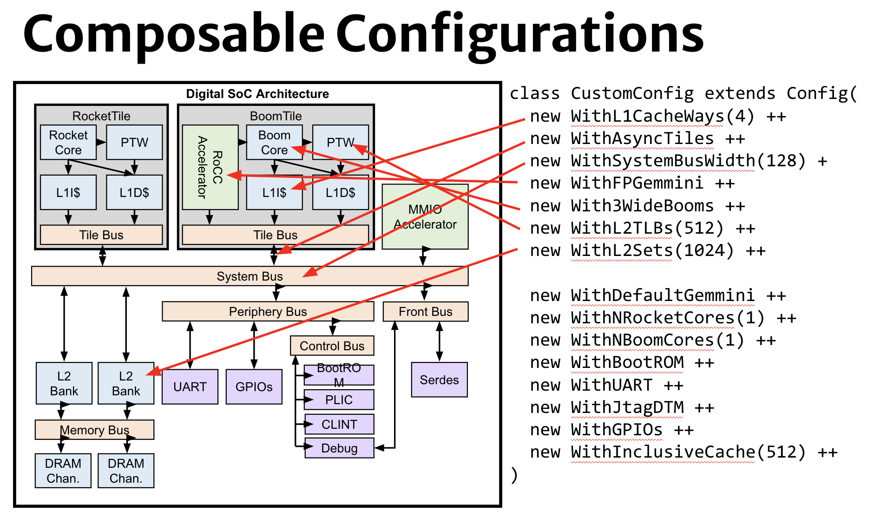

# Lab 2c) OFOT Generator In Chipyard

## Overview

So far, you learned Chisel, explored Chipyard, and got familiar with the `OFOTile`, which adapts your blackbox-ed EECS151LA core's memory interface to TileLink. Now we are closer than ever to integrating your core into the entire SoC - and, to begin with, defining what your SoC will look like!

For example, a sample architecture we considered for this SoC looked like:


Notice how the SoC contains modules you now recognize such as Rocket Core, the TileLink Adapter, common buses..

This lab will switch gears into this broader picture - how does Chipyard bring these architectures to life, while abstracting away much of the complexity and making use of a complex assemblage of scripts (such as SBT files) and Scala constructs (such as mixins)? As we saw, TileLink is at the core of this 'plug and play' heterogenous integration - if every block speaks the same langauge, it's a lot simpler to connect them all together, even without knowing the specifics of the block.

While this lab has quite a bit of reading, use it to motivate how you can modify this base design from single core to multi-core and what the SoC may need to successfully boot up and function. **Note that there is a Lab 2X addendum that goes into more detail for those who really want to know _how_ things work, but it's optional.**

# Part 1) Chipyard SBT Files

## Introduction to SBT

You will find in the documentation: "Chipyard is a complex framework that depends on a mix of build systems and scripts. Specifically, it relies on git submodules, on sbt build files, and on custom written bash scripts and generated files."

Generally, `sbt` (Simple Build Tool) is a command-line build tool for Scala, Java, and more. There are many build tools out there. 

**But what is a build tool?**

So far you've been working with just two source files. With only a few Scala files, it's easy enough to compile with `scalac MainFile.scala` in the command line. Chipyard, however, is made up of hundreds of files. A build tool helps manage the complexity of all those compilations. `sbt` is nice becauses it uses a small number of concepts but supports flexible and powerful build definitions. If you want to read more, you can go through the Getting Started guide [here](https://www.scala-sbt.org/1.x/docs/Getting-Started.html), but the level of understanding of `sbt` you need for Chipyard is quite minimal.

An `sbt` build file, also known as `build.sbt`, is a configuration file used to define the structure and dependencies of a Scala project. It lists locations for your source files and relevant information. Then `sbt` reads the file to compile the project. It can also automatically manage dependencies, downloading the versions of the libraries you declare as needed. 

Some key elements of an `build.sbt` file include:

- **Settings**: Customizable build settings, like compiler options, source directories, and output directories.
- **Dependencies**: Lists of libraries and frameworks required by the project.
- **Tasks**: Definitions of build actions, such as compiling, testing, and packaging the project.

**Here is an example build.sbt file:**

What we see here is an `sbt` project with associated sources. 

````
scalaVersion := "2.13.12"

organization := "ch.epfl.scala"
name := "hello-world"
version := "1.0"

libraryDependencies += "org.scala-lang.modules" %% "scala-parser-combinators" % "2.3.0"
````

This build file defines:

- Scala version 2.13.12
- Organization “ch.epfl.scala”
- Project name “hello-world”
- Version 1.0
- Dependency on scala-parser-combinators version 2.3.0

## SBT in Chipyard

In the top-level of your Chipyard repository (ex: `ofot-chipyard`), you will find a `build.sbt` file. 

**Multi-Project Builds** are a core feature of `sbt`. You can find more information [here in the scala-sbt docs](https://www.scala-sbt.org/1.x/docs/Multi-Project.html). An excerpt:

> It can be useful to keep multiple related subprojects in a single build, especially if they depend on one another and you tend to modify them together.

> Each subproject in a build has its own source directories, generates its own jar file when you run package, and in general works like any other project.

> A project is defined by declaring a lazy val of type Project. For example:
> `lazy val util = (project in file("util"))`
> `lazy val core = (project in file("core"))`

In the case of Chipyard, many of these projects are git submodules (subprojects).

## Adding a generator to SBT

The essence of the constructs you see is that they allow code in parent projects to view Scala packages defined in the child project.

In the file, find `lazy val chipyard = (project in file("generators/chipyard"))`. Based off the above, what is this line doing?

**[Gradescope] What `lazy val` in `.dependsOn` tells `sbt` where our `ofo` generator is? What does our generator itself depend on?**

You don't have to submit this, but think - how would you add your own project into this structure? `sbt` does a lot of things. Luckily we don't need to modify it too much to add our generator. You are no worse off if you simply pattern match whenever you need to add your own module. :)

# Part 2) Fire off to top-level!

Now our generator is discoverable as part of the build system. However, so is every other generator - that doesn't mean it is actively generating hardware for every SoC. In addition, having claimed so far that our design is parametrizable, where do we pass in those "parameters"? 

To understand this, let's take a look at a few other important concepts in Scala, Chisel, and Chipyard. We will then start to see how the most top-level configuration files in Chipyard interface with our generator and how we may modify them to configure the SoC of your dreams! 

## "Mixins" and the Cake analogy

Let's start with the [1.3.3. Cake Pattern / Mixin](https://chipyard.readthedocs.io/en/stable/Chipyard-Basics/Configs-Parameters-Mixins.html#parameters) documentation. Some excerpts:

> A cake pattern or mixin is a Scala programming pattern, which enable “mixing” of multiple traits or interface definitions (sometimes referred to as dependency injection). It is used in the Rocket Chip SoC library and Chipyard framework in merging multiple system components and IO interfaces into a large system component.

The term cake may come up in conversation, and you want to be braced for the unhappy surprise that people are not discussing free cake leftover in the kitchen. D: 
A cake or 'mixin' is just the combination of multiple traits (i.e. interfaces) to form their superset.

**[Gradescope] In the following (incomplete) example, how many cakes/`mixin`s are present?** Hint: check the documentation - the concept might not be as intuitive as you think. 

```
class DigitalTop(implicit p: Parameters) extends ChipyardSystem
  with sifive.blocks.devices.i2c.HasPeripheryI2C // Enables optionally adding the sifive I2C
  with sifive.blocks.devices.pwm.HasPeripheryPWM // Enables optionally adding the sifive PWM
  with sifive.blocks.devices.uart.HasPeripheryUART // Enables optionally adding the sifive UART
  with constellation.soc.CanHaveGlobalNoC // Support instantiating a global NoC interconnect
{
  override lazy val module = new DigitalTopModule(this)
}

class DigitalTopModule[+L <: DigitalTop](l: L) extends ChipyardSystemModule(l)
  with sifive.blocks.devices.i2c.HasPeripheryI2CModuleImp
  with sifive.blocks.devices.pwm.HasPeripheryPWMModuleImp
  with freechips.rocketchip.util.DontTouch
```

## DigitalTop and ChipTop

Note the name of the class above. As we finish up focusing on the core, understanding class `DigitalTop` (and in turn, what's actually part of your SoC by default) is increasingly important. You will also see `ChipTop`, a top-level module that's usually an instance of `DigitalTop`. 

> The three highest levels of hierarchy in a Chipyard SoC are the `ChipTop` (DUT), `TestHarness`, and the `TestDriver`. The `ChipTop` and `TestHarness` are both emitted by Chisel generators. The `TestDriver` serves as our testbench, and is a Verilog file in Rocket Chip.

Don't worry if this doesn't make sense yet, but do find the relevant files:

**[Gradescope] In what directory are your `ChipTop` and `DigitalTop`?** Note which generator this is!

For now we don't need to add anything to these, but you might later!

# Part 3) Configs - The _Somewhat_ Top Level

Wait a second, aren't the `Top` files at the _top_ of the hierarchy? Why did we skim past them so quickly?

The majority of complexity and parameterization within an SoC lies within the chip, not at its interface to the outside world.
Chipyard enables us to navigate this vast design space by constructing named sets of generator instances called `Config`s.

## Introduction to Configs 

Up until now, we were working at the generator (e.g. a single CPU on a tile) level.
An SoC `Config` might instantiate our OFO generator as well as any number of other generators with chosen parameters to elaborate the toplevel design.


The [1.3. Configs, Parameters, Mixins, and Everything In Between](https://chipyard.readthedocs.io/en/stable/Chipyard-Basics/Configs-Parameters-Mixins.html) documentation does a pretty good job of explaining configs. A few choice segments:

> A significant portion of generators in the Chipyard framework use the Rocket Chip parameter system. This parameter system enables for the flexible configuration of the SoC without invasive RTL changes.

Recall the `Params` from Lab 2b!

> A config is a collection of multiple generator parameters being set to specific values. Configs are additive, can override each other, and can be composed of other configs (sometimes referred to as config fragments). The naming convention for an additive config or config fragment is With<YourConfigName>, while the naming convention for a non-additive config will be <YourConfig>. Configs can take arguments which will in-turn set parameters in the design or reference other parameters in the design.

Essentially, Chipyard has a lot of generators, many of which you're now familiar with, at least in passing.
How do you configure them all? `Config`s allow designers to hirearchically collect and cmopose useful generator instances (a generator instance is the generator plus a set of parameters).
A `Config` is composed of Config "fragments".
“Fragments” set/override/adjust/clear keys in the Config object's "environment" (a key->value mapping).
Generators (your CPU generator, the Rocket Chip generator, Chipyard generator...) query this “Config” object at elaboration time to figure out how they should be configured.

> This example shows a basic config fragment class that takes in zero arguments and instead uses hardcoded values to set the RTL design parameters. In this example, MyAcceleratorConfig is a Scala case class that defines a set of variables that the generator can use when referencing the MyAcceleratorKey in the design.

```
class WithMyAcceleratorParams extends Config((site, here, up) => {
  case BusWidthBits => 128
  case MyAcceleratorKey =>
    MyAcceleratorConfig(
      rows = 2,
      rowBits = 64,
      columns = 16,
      hartId = 1,
      someLength = 256)
})
```

If that is confusing, here's an even simpler example. This fragment changes the BankedL2Key to set its nBanks field to the desired number of banks (where banks is a concept in [cache memory](https://en.wikipedia.org/wiki/Memory_bank)):

```
class WithNBanks(n: Int) extends Config((site, here, up) => {
  case BankedL2Key => up(BankedL2Key, site).copy(nBanks = n)
})
```

> This next example shows a “higher-level” additive config fragment that uses prior parameters that were set to derive other parameters.

```
class WithMyMoreComplexAcceleratorConfig extends Config((site, here, up) => {
  case BusWidthBits => 128
  case MyAcceleratorKey =>
    MyAcceleratorConfig(
      Rows = 2,
      rowBits = site(SystemBusKey).beatBits,
      hartId = up(RocketTilesKey, site).length)
})
```

That is, instead of hard coding `rowBits = 64`, we can now reference `SystemBusKey`. The `up` and `site` objects can be quite confusing, but you'll see them show up often, so it's helpful to gain some intuition for what they're doing.

> The `site`, `here`, and `up` objects in `WithMyMoreComplexAcceleratorConfig` are maps from configuration keys to their definitions. The `site` map gives you the definitions as seen from the root of the configuration hierarchy (in this example, `SomeAdditiveConfig`). The here map gives the definitions as seen at the current level of the hierarchy (i.e. in `WithMyMoreComplexAcceleratorConfig` itself). The up map gives the definitions as seen from the next level up from the current (i.e. from `WithMyAcceleratorParams`).

**[Gradescope] Why do `Config` fragments exist? Can't we just set every key in the toplevel config for an SoC?**

In short, you can think of the Rocket Chip parameter system as a global key->value store. Config fragments change the values of keys. Querying the `Config` object means accessing the key->value store (i.e. `p(key)` where `p` is of type `Parameters`).

### A Bit of a Deeper Look 

At this point, you are likely to get confused. Maps? Keys? Where is all this coming from? Many people will take the code for granted and pattern match what seems to work until intuition builds up. This section is meant to give you more context so that you can build up intuition quicker. For an even deeper look, read Lab 2X, the addendum.

When talking about configs, the fundamental abstract is called a `View`. A **View** is a **key-value** store or hash map with a special property: the value corresponding to a particular key is conditioned on a "context".

More broadly, Chipyard/Rocket Chip function in "context-dependent environments" [(CDEs)](https://chipyard.readthedocs.io/en/stable/Advanced-Concepts/CDEs.html), enabling much more elegant composability.
One example of this is overriding, where a key set in a config fragment can be re-set (overriden) by a toplevel config.

With this background, let's revisit another simple example:
```
class WithNExtInterrupts(nExt: Int) extends Config {
  (site, here, up) => {
    case NExtInterrupts => nExt
  }
}

class MyConfig extends Config (
  new WithNExtInterrupts(16) ++ 
  new DefaultSmallConfig
  )
```

Recall that `Views` are (context-dependent) key->value mappings. When you do a look-up, you are matching in these `case`s looking for a certain key.

The `key` here is the number of [external interrupts](https://www.geeksforgeeks.org/external-and-internal-interrupts/). It maps to an integer (`Int`) value. 

The above snippet defines a subclass `MyConfig` of the class `Config` that we described above, and parameterizes it with the number of external interrupts by including the `WithNExtInterrupts` fragment (which sets `NExtInterrupts` to the provided value, here 16).

The base config (you can think of this as setting the "default" values for standard keys in a config) is `DefaultSmallConfig`.

The default of `MyConfig` will be the `DefaultConfig` with the number of interrupts set to 16.
Simple `Config`s can be composed to create much more complicated `Config`s!

Note this point in the documentation:

> The following example shows a non-additive config that combines or “assembles” the prior two config fragments using ++. The additive config fragments are applied from the right to left in the list (or bottom to top in the example). Thus, the order of the parameters being set will first start with the `DefaultExampleConfig`, then `WithMyAcceleratorParams`, then `WithMyMoreComplexAcceleratorConfig`.

```
class SomeAdditiveConfig extends Config(
  new WithMyMoreComplexAcceleratorConfig ++
  new WithMyAcceleratorParams ++
  new DefaultExampleConfig
)
```

Note that the main additional takeaway is that the order of the Configs matters!
Config [fragments] at the 'top' of the definition will override keys previously set by 'lower' config [fragments].

**[Gradescope] Which of the following is most similar to Chipyard's Config and Parameter systems: an all-to-all crossbar, a recursive dictionary, a circular linked list, a priority queue?**

### Composable Configs in Action

These configurarations are not just about minor overwrites. Your whole SoC configuration is defined through a `Config`. 



There's very many different core / accelerator / peripheral / memory-system / etcetera configurations. Every single generator we've talked about can be configured (that's the point of "parametrizable"!) Some other examples include:

- Custom interfaces to off-chip memory (Serdes/QSPI/DDR)
- APIs for integrating PLLs, setting up clock muxes/dividers
- Clock-domain construction + CDC APIs
- Integration with analog device models
- Coherent/incoherent memory architectures

#### It's (not) Rocket Science

There's somewhat of an explanation of Rocket Chip Configs in [3.9. Rocket-Chip Generators](https://chipyard.readthedocs.io/en/stable/Generators/Rocket-Chip-Generators.html), but it'll be easier to understand by looking at the Scala itself. Navigate to, from the toplevel Chipyard repository:

```generators/chipyard/src/main/scala/config/RocketConfigs.scala```

Here you will find multiple complete Rocket Chip SoC configurations, including the very basic:

```
class RocketConfig extends Config(
  new freechips.rocketchip.rocket.WithNHugeCores(1) ++         // single rocket-core
  new chipyard.config.AbstractConfig)

class DualRocketConfig extends Config(
  new freechips.rocketchip.rocket.WithNHugeCores(2) ++
  new chipyard.config.AbstractConfig)

class TinyRocketConfig extends Config(
  new testchipip.soc.WithNoScratchpads ++                         // All memory is the Rocket TCMs
  new freechips.rocketchip.subsystem.WithIncoherentBusTopology ++ // use incoherent bus topology
  new freechips.rocketchip.subsystem.WithNBanks(0) ++             // remove L2$
  new freechips.rocketchip.subsystem.WithNoMemPort ++             // remove backing memory
  new freechips.rocketchip.rocket.With1TinyCore ++                // single tiny rocket-core
  new chipyard.config.AbstractConfig)
```

From the names (i.e. no `With` prefix), you can tell that these are 'full' configs, and are to be used either on their own or as default values for other configs.

This is your last chance to select the number of cores (the default "core" referred to is Rocket Core), your memory structure, prefetchers, accelerators, and much more, before declaring which top-level Config you will use.

A 'true' (i.e. tapeout ready) top-level config would include fragments related to IO, or the interface between the SoC and the outside world.
Pay special attention to `AbstractConfig`. The `AbstractConfig` is the most generic default, that sets up the SoC in a "mostly sane" way. For example, it sets up:

- The five traditional TileLink buses (S system, P peripheral, C control, M memory, F front bus)
- Peripherals such as UART (communication) and JTAG (debugging)
- A 64kB scratchpad (on-chip memory) off the S-bus (system bus)
- Etc.

This default (and defaults in general) is invaluable and part of the reason why you can create a whole SoC without understanding every detail of it!

**[Gradescope] What existing Config in `RocketConfigs` would allow you to add existing prefetcher designs to your SoC? Name two of those prefetchers.**

**[Gradescope] What line would add 2 BooM (Berkeley Out-of-Order Machine) cores to your SoC (because you think they're very cool!)?**

You can actually list most of the available Config options across all Chipyard packages using ``make find-config-fragments``. You can run it from any simulation tool directory, such as Verilator, VCS, or [xcelium](https://www.cadence.com/en_US/home/tools/system-design-and-verification/simulation-and-testbench-verification/xcelium-simulator.html):

```
cd $CHIPYARD_DIRECTORY/sims/vcs
make find-config-fragments
```

**[Gradescope] What's one Config you'd like to put on your SoC and what does it do?**

**If you look around Chipyard, you will find many files that define these `Config` objects and provide named settings (fragments that set keys).**

Additional, toplevel `Config`s compose those partial Configs into complete configurations that supply all the key-value pairs needed to generate a particular design. That's how the nested key-value hierarchy works!

## Implementing the OFOT Generator (Core and Adapter) Config

These Configs do not come out of nowhere - we need to extend a Config class in our generator! For this, we need to revisit the `CanAttachTile` and a new `WithOFOCores` class.

### `CanAttachTile` Throwback

Recall the skeleton of `OFOTile.scala` in `generators/ofo`:

```
case class OFOTileParams(
  // Code here
}

class OFOTile(
  // Code here
}

class OFOTileImp(outer: OFOTile) extends BaseTileModuleImp(outer) {
  // Code here
}

case class OFOTileAttachParams(
  // Code here
}
```

We've defined a `Tile` (diplomacy code) and its `Params`, the Tile Implementation (hardware code), and a `CanAttachTile` class which allows to us attach our tile within a `Config`.

This `CanAttachTile` is nice, because we can connect the Tile directly to the other diplomacy nodes.
But as the name suggests, `CanAttachTile` is not `PleaseAttachMyTileNow` (which is not a real class).
That is, we need an extra Config class to actually attach the Tile to the rest of the system.

### The "With" Prefix 

Take a look at the `Config` fragment in `src/main/scala/OFOConfigs.scala`. It wil start like this:

```
class WithOFOCores(cores: Seq[OneFiftyOneCoreParams]) extends Config((site, here, up) => {
  case TilesLocated(InSubsystem) => {
```

Prefixing a `Config`'s name  with `With` indicates that it's a **fragment** to be used **additively** (i.e. stacked, potentially with other fragments, on top of a base config). This is a convention that you can _technically_ disobey, but conventions allow us to wrangle complexity without relying on complex langauge features. Conventions are the original [zero cost abstraction](https://without.boats/blog/zero-cost-abstractions/)!

While we could technically put everything into the `OFOTile.scala` file, it's cleaner to split up a module and its configuration into multiple files (also, some fragments may reference multiple Tiles or modules).

**[Gradescope] Write a `With` format Config fragment for your Placebo Accelerator from Lab 2B!** Note: your fragment could be much simpler than `WithOFOCores`.

#### A few specifics..

Cue the Hart puns! <3 You'll notice that a section of the `WithOFOCores` fragment 'calculate[s] the next available hart ID'.

The word `hart` (HARdware Thread) will come up often in the context of RISC-V architecture. It is an abstraction of a hardware thread, capturing the essential aspects of a real hardware thread for the purposes of defining the RISC-V specifications. Read the adddendum, Lab 2X, to learn more!

In RISC-V, each hart needs its own ID. Here, we use a variable `idOffset` to find the next available ID, since each tile has a hart ID.
This is used to tell diplomacy that it needs to instantiate your core (and to use this "id" to keep track of it).

**[Gradescope] Why do we need an 'address offset' for a given core when looping over the cores?** *Hint: what does `memStart` dictate?*

As of this writing, multi-ofo-core behavior is unverified. If you're interested in working on multi-core verification and interactions, let us know. :).

Until we can be confident multiple cores are supported, the `require` assertion syntax is used to enforce that the list `cores: Seq[MY_CORE_PARAMS]` is only one core long. You can comment it out if you'd like to experiment. 

```
// Requirements
require(cores.size == 1, "This project doesn't _currently_ support multiple cores.")
```

The `require` function is a helpful construct for detecting illegal states that you will recognize in different parts of Chipyard.
`require`s are the idiomatic way to "codify your assumptions" at elaboration time, and should be used liberally.
They are only evaluated at elaboration time, and never end up in the RTL.

``require(dp(ClockInputOverlayKey).size >= 1)``

``require(config.size % blockBytes == 0)``

`assertion`s are checks that are compiled into the RTL for simulation (or formal verification) and are evaluated at runtime.
They should be used when testing to make sure illegal states or undesired behavior is not encountered.

"If you solve a bug, strongly contemplate what `assert()` could have caught this bug and then add it." -[Chisel style guide](https://github.com/ccelio/chisel-style-guide)

## Your Dream SoC Config!

It's great that we have this Config fragment, but it's not yet nested into a top-level Config representative of our whole SoC, so it's not being used. Recall your overviews of [1.3. Configs, Parameters, Mixins, and Everything In Between](https://chipyard.readthedocs.io/en/stable/Chipyard-Basics/Configs-Parameters-Mixins.html) and [3.9. Rocket-Chip Generators](https://chipyard.readthedocs.io/en/stable/Generators/Rocket-Chip-Generators.html) earlier.  

Navigate to, from the toplevel Chipyard repository:

```generators/chipyard/src/main/scala/config/OFOConfigs.scala```

Here you will find a few more SoC configurations we've been using. But you won't use those - instead, make your own! 

**Step 1)** **Copy over the Rocket Configs template**

At the bottom of ```generators/chipyard/src/main/scala/config/OFOTConfigs.scala```, create a new Config. For now we recommend starting with a setup such as (the name can be changed):

```
class MyCoolChipConfig extends Config(
    // 0) Anything else you'd like? 

    // 1) Include an OFO core with `OFOCoreParams` passed in

    // 2) Include one tiny Rocket Core

    // 3) Remove the scratchpad

    new testchipip.serdes.WithSerialTLMem(size = MAGIC_NUMBER) ++ // 4) Configure the off-chip memory accessible over serial-tl as backing memory

    // 5) Remove off-chip AXI port (referred to as just MemPort)

    // 6) off-chip bus connects to MBUS to provide backing memory

    // 7) Attach off-chip bus

    new chipyard.config.WithBroadcastManager ++ // 8) Replace L2 with a broadcast hub for coherence

    // 9) The most generic SoC default configuration to inherit from
)
```

**Step 2)** **Fill out the template** 

Unlike the previous Config we made, this is a very common setup, so we'd like you to do it yourself! You should have nine lines of configuration in this Config. You can fill them out in any order, but each is one line.

**// 1) Include my new generator core(s) with my CoreParams passed in**

- This is where you want to add your generator (at the very top so nothing overwrites it)! Note how in other examples, `testchipip`, `config`, etc, are packages. You also have a package. 

- You also have `Params` you pass into your `With` Config. How might you use this information? 

**// 2) Include one tiny Rocket Core**

- You can reference some of the other Configs for how to do this. We would like a Rocket Core as a proven working core on the SoC, that can also help us with interrupt and boot handling. 
  
- But a smaller Rocket core will make place and route easier.

**// 3) Remove the scratchpad**

- A scratchpad is a type of on chip memory: [https://en.wikipedia.org/wiki/Scratchpad_memory](https://en.wikipedia.org/wiki/Scratchpad_memory). For now we'd like to remove it, as we are not using it and don't know if it'll work in SKY130.

**new testchipip.serdes.WithSerialTLMem(size = MAGIC_NUMBER) ++ // 4) Configure the off-chip memory accessible over serial-tl as backing memory**

- This is for off-chip memory. Set it to one gigabyte. Hint: you may want to use a format like `(size = (A << B) * C)`. What might this mean?

**// 5) Remove off-chip AXI port (referred to as just MemPort)**

- You can find this in other Configs by searching (grep'ing) the repo, possibly not in this Rocket Configs file. 

**// 6) off-chip bus connects to MBUS to provide backing memory**

- Your serial TileLink should be through an off-chip bus (O-bus), and we're saying it should be attached through the memory bus (m-bus). Has this been shown elsewhere?

**// 7) Attach off-chip bus**

- This is that off-chip bus! How may you attach it?

**new chipyard.config.WithBroadcastManager ++ // 8) Replace L2 with a broadcast hub for coherence**

- This is found by looking through how other setups are done (such on FPGA), so we're giving it to you.

**// 9) The most generic SoC default configuration to inherit from**

- This should be the easiest one!

The great thing about open-source projects is that there are plenty of high-quality `Config`s you can ~~copy~~ reference when something doesn't work! You're welcome to try adding whatever else you'd like to your Config before moving on. 

**[Gradescope] Submit your final Config! What does your dream SoC look like?**

# Part 4) Synthesizing the Best SoC in the World!

You're now ready to pass your SoC `Config` to Chipyard where a `ChipTop` containing a `DigitalTop` containing the desired generators will be created, parameterized with the key->values you've selected (or their defaults).

You can now synthesize your SoC `Config` directly with a command like:

```
> cd $MCYDIR/vlsi
> make syn CONFIG=MyCoolSoCConfig
```

You can also run the rest of the physical design flow by running `make CONFIG=MyCoolSoCConfig` commands in `vlsi/` with targets like `syn`, `par,` `drc`, and `lvs`. Recall the command you ran in Lab 1B Chipyard Setup - ``make drc tutorial=sky130-commercial IS_TOP_RUN=0`` - you were running a tutorial VLSI flow! We will run the rest of the flow in the physical design lab and explore simulation in the verification lab.

**[Gradescope] Synthesize your dream SoC with `make syn CONFIG=???` and screenshot the last 10 lines of the output to make sure it completes!**

Chipyard also produces a visual representation of your SoC in the form of a diplomacy graph! Instructions on how to view this representation can be found [here](https://chipyard.readthedocs.io/en/stable/Simulation/Software-RTL-Simulation.html#visualizing-chipyard-socs). Note that you'll need to elaborate the Verilog (e.g. run a `make` command in `sims/<tool>` or `vlsi/`) to generate this graph.

**[Gradescope] Submit a screenshot of your SoC's `*.graphml` graph and box the part that corresponds to your tile!**

# Summary

This lab guided you through integrating your EECS151 core generator into Chipyard through `sbt` files and various `Config` classes. You did a significant amount of reading - sorry! - understanding how parametrization works in the Chipyard hierarchy. You then designed your own SoC Config, choosing parameters and SoC modules to include. You ran your new SoC through the first part of the VLSI flow - synthesis - and took a look at the resulting diplomacy (interconnect) graph.

At this point, you are missing only two concepts - verification and physical design! Of course, there's a lot more to explore, and we encourage you to skim Lab 2X to grep more theory and to do your own design experiments to get more hands-on practice. 

# Credits

Some of the images used in this document come from an ISCA 2023 Chipyard tutorial:

- 2: ["SoC Architecture and Components", ISCA 2023, Jerry Zhao.](https://docs.google.com/presentation/d/1L1qZAWrmwDzdZjeATT14WbpVSePEb_kH/edit#slide=id.p1)
- 3: ["Generating and Simulating Custom SoCs", ISCA 2023, Jerry Zhao.](https://docs.google.com/presentation/d/1JgkhiyqWGCEa0ZTHQ3zyY7TvqCzlFw9h/edit#slide=id.p76)

Some information is taken from Henry Cook's Chisel Conference 2018 Rocket Chip presentation (public but may or may not be information overload):

- ["Rocket Chip Intensive (Architecture Track)", Chisel Community Conference 2018, Henry Cook.](https://www.youtube.com/watch?v=Eko86PGEoDY&t=1748s)

Useful references:

- [Chipyard Docs: 1.3. Configs, Parameters, Mixins, and Everything In Between](https://chipyard.readthedocs.io/en/stable/Chipyard-Basics/Configs-Parameters-Mixins.html)
- [Chipyard Docs: 3.9. Rocket-Chip Generators](https://chipyard.readthedocs.io/en/stable/Generators/Rocket-Chip-Generators.html)
- More Chipyard references: [https://github.com/ucb-bar/chipyard](https://github.com/ucb-bar/chipyard)
- [https://www.scala-sbt.org/](https://www.scala-sbt.org/)
